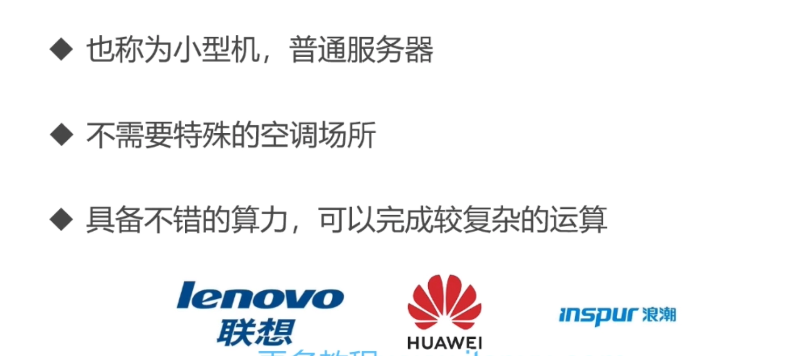
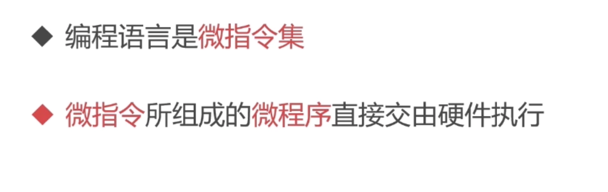
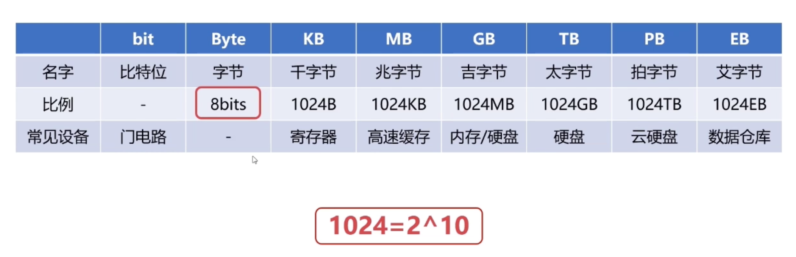
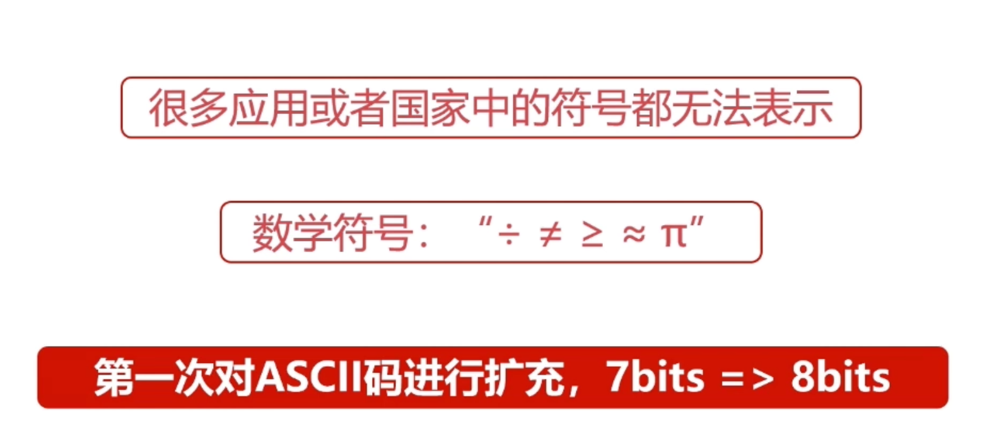
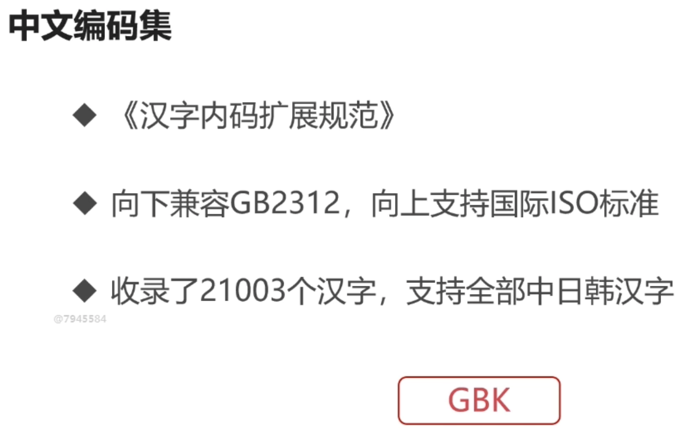

# 计算机组成原理
## 计算机组成原理概述

### 计算机发展简史

* 计算机发展的四个阶段

  

  * 第一阶段：电子管计算机

    

    

    

    * 第二次世界大战是电子管计算机产生的催化剂

      * 英国为例解密德国海军的秘闻创造了第一个电子管计算机

        

      * 埃尼阿克

        

        

        

  * 晶体管计算机

    

    

    

    

    * 贝尔实验室的三个科学家发明了晶体管

  * 集成电路计算机

    

    

    

    

    * 德州仪器的工程师发明了集成电路（IC）

  * 超大规模集成电路

    

* 未来的计算机

  * 生物计算机

    

    

  * 量子计算机

    

    

* 微型计算机的发展历史

  * 受限于性能

    

  * 摩尔定律

    20世纪已经慢慢失效了

    

  * 多核CPU

    

### 计算机的分类

* 超级计算机

  

  

  

  

* 大型计算机

  

  

  

  

* 迷你计算机（服务器）

  

  

* 工作站

  

  

* 微型计算机

  

  

### 计算机体系结构

* 冯诺依曼体系

  

  

  

  

  

  * 五大组成部分

    存储器 运算器  控制器 输入 输出

* 现代计算机体系结构

  

  

  

### 计算机的层次与编程语言

* 程序翻译与程序解释

  

  

  

  

  

  

* 计算机的层次与编程语言

  

  * 硬件逻辑层

    

  * 微程序机器层

    

  * 传统机器

    

    

  * 操作系统

    

  * 汇编语言层

    

    

  * 高级语言

    

  * 应用层

    

* 总结

  

### 计算机的计算单位

* 容量单位

  

  

  

  

  

  

* 速度单位

  * 网络速度

    

  * cpu速度

    

    

    

### 计算机的字符与编码集

* 字符编码集的历史

  * ASII码

    

    

    

    

  * 字符编码集的国际化

    

  * 中文编码集

    

    

    

    

##  计算机组成原理之组成篇

20191221221418.png)

20191221221505.png)

### 计算机总线

* 总线的概述

  

* 总线的分类

### 计算机的输入输出设备

### 计算机存储概述

### 计算机的主存储器与辅助存储器

### 计算机的高速缓存

### 计算机的指令系统

### 计算机的控制器

### 计算机的运算器

### 计算机指令执行的规程

##  计算机组成原理之计算篇

### 进制运算的基础

### 有符号书与无符号数

### 二进制的补码表示

### 二进制的反码表示

### 小数的二进制补码表示法

### 定点数的加减法运算

### 浮点数的加减法运算

### 浮点数的乘除运算

## 计算机组成原理实践

### 双向链表的原理与实践1

### 双向链表的原理与实践2

### 实现FIFO缓存置换算法

### 实现LFU缓存置换算法

### 实现LFU缓存置换算法

# 操作系统

## 基础篇

### 操作系统概述

### 进程管理值进程实体

### 进程管理之五状态模型

### 进程管理之进程同步

### Linux的进程管理

### 作业管理之进程调度

### 存储管理之内存分配与回收

### 存储管理之段页式存储管理

### 存储管理之虚拟内存

### Linux的存储管理

### 操作系统的文件管理

### Linux文件的基本操作

### Linux的文件系统

### 操作系统的设备管理

## 操作系统提升篇

### 线程同步之互斥量

### 线程同步之自旋锁

### 线程同步之读写锁

### 线程同步之条件变量

### 线程同步方法总结

### 使用fork系统调用创建进程

### 进程同步之Unix域套接字

## 操作系统实战

### Python同步原语

### 实现线程安全的队列Queue

### 实现基本任务对象Task

### 线程池简介

### 实现任务处理线程PorcessThread

### 实现任务处理线程池Pool

### 编写测试用例

### 事项异步任务处理AsyncTask

# 计算机网络原理

## 概述

### 计算机网络发展简史

### 层次结构设计的基本原则

### 计算机网络的性能指标

### 物理层概述

### 数据链路层概述

### 数据链路层的差错检测

### 最大传输单元MTU

### 以太网传输单元MTU

### 以太网协议详解

## 网络层

### IP协议与RARP协议

### ARP协议与RARP协议

### IP地址的子网划分

### 网络地址转换NAT技术

### ICMP协议的应用

### 网络层的路由概述

### 内部网关路由协议的应用

### 内部网关路由协议之RIP协议

### Dikstra（迪杰斯特拉）算法

### 内部网关路由协议之OSPF协议

### 玩不网关路由协议之RIP协议

### 外部网关路由协议之BGP协议

## 传输层

### UDP协议

### TCP协议

### 可靠性的基本原理

### TCP协议的可靠传输

### TCP协议的流量控制

### TCP连接的三次握手

### TCP连接的四次握手

### 套接字与套接字编程

### TCP协议的四个定时器

## 应用层

### DNS详解

### DHCP协议详解

### HTTP协议详解

### HTTP工作的结构

### HTTPS协议详解

## 计算机网络实战

### 搭建服务基本框架

### Python操作字节序列

### 实现IP报文解析

### 实现UDP报文解析

### 实现TCP报文解析

## 课程精髓终结

### 课程总结-计算机组成原理

### 课程总结-操作系统

### 课程总结-计算机网络

### 课程总结-编程实践

### 课程展望

