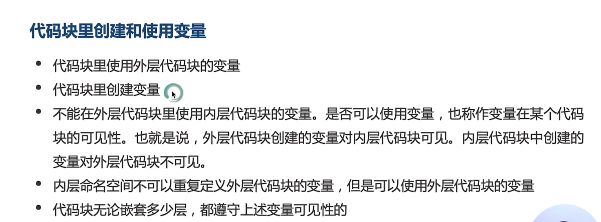
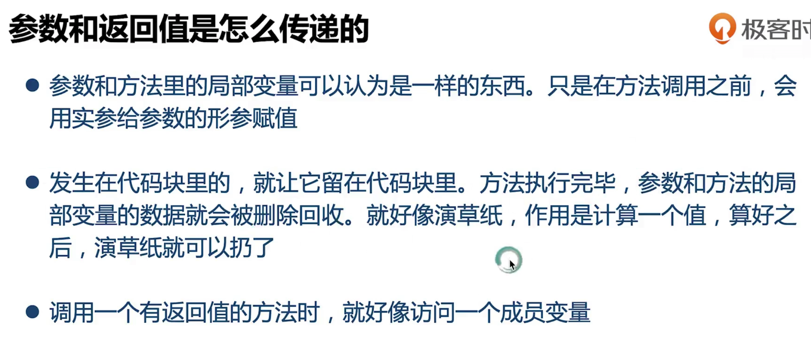

## java基础

* 表达式与语句

  ```java
  int y = a*x + b*x*x +c*x；
  ```

  上面到分号结束是一个语句，而a*x、b*x*x都可以叫表达式

  

* 除赋值运算以为，运算符本身并不会改变数的大小

* 精度自动转换

  

  

* 强制类型转换】

  强制类型转换会导致精度丢失

  ```java
  float f = 10.5f;
  int a = (int)f 
  ```

* 数值溢出

  超出范围之后会造成数据失误

* 变量的作用域

* 

  

* break

  

* 变量

  

  

* 数组

  

* 数组执向新的地址

* 

  

* java对象的创建

* 

* 引用的缺省值-null

  

* 调试

  

* 参数和返回值

  

* 参数、局部变量、实例的地盘

  

* 方法

  

  

  

* this

  指代当前对象

* 封装

  

* 重载

  

* 参数匹配规则

  

  

* 构造方法

  

* 静态变量

  也叫类变量，从属于类只有一份

* 静态方法

  

  

* 权限控制

  

  **TODO**后续补上

* String

  

  

* 

  

