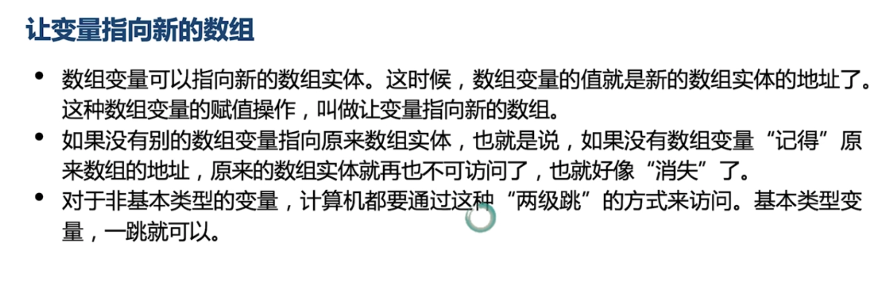

## java基础

* 表达式与语句

  ```java
  int y = a*x + b*x*x +c*x；
  ```

  上面到分号结束是一个语句，而a*x、b*x*x都可以叫表达式

  

* 除赋值运算以为，运算符本身并不会改变数的大小

* 精度自动转换

  

  

* 强制类型转换】

  强制类型转换会导致精度丢失

  ```java
  float f = 10.5f;
  int a = (int)f 
  ```

* 数值溢出

  超出范围之后会造成数据失误

* 变量的作用域

* 

  

* break

  

* 变量

  

  

* 数组

  

* 数组执向新的地址

* 

  

* java对象的创建

* 

* 引用的缺省值-null

  

* 调试

  

* 参数和返回值

  

* 参数、局部变量、实例的地盘

  

* 方法

  

  

  

* this

  指代当前对象

* 封装

  

* 重载

  

* 参数匹配规则

  

  

* 构造方法

  

* 静态变量

  也叫类变量，从属于类只有一份

* 静态方法

  

  

* 权限控制

  

  **TODO**后续补上

* String

  

  

* 继承与组合

  
  
  
  
* 父子类的引用赋值关系

* 

  20191209220606
  
  
  
  
  
* 重载

  
  
* 多态

  * 静态多态 重载
  * 动态多态 覆盖
  
  多态的核心：要调用哪个类，那个方法，这个方法用到的数据（this引用）是谁
  
* final

  * 类 不可被继承
  * 方法  不可被子类覆盖
  * 变量   不可被赋值
  
* 抽象类

  
  
* 接口

  支持缺省实现的抽象方法 前面要用default
  
  接口中的this指的是实现这个接口的类的对象
  
  
  
  
  
* 静态内部类

  
  
  
  
  
  
* 成员内部类

  
  
  
  
* 局部内部类

  
  
  
  
  
  
* 匿名类

  
  
* 内部类

  
  
  
  
* 匿名类

  
  
  
  
* 总结

  
  
  
  
* negligible

  20191209235858.png

* 插件

  grep console

* 工具类库

  20191210000208.png

  20191210000428.png

  20191210000550.png

* 

  

  

  

