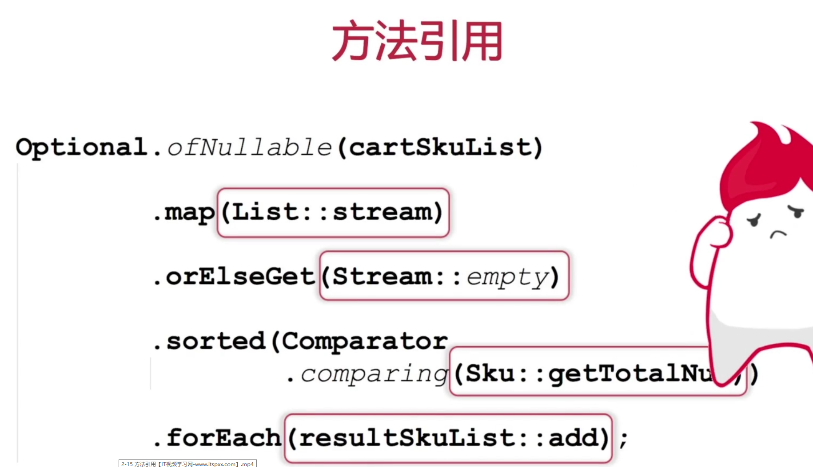
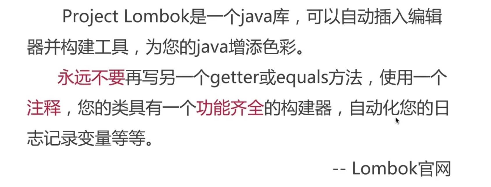
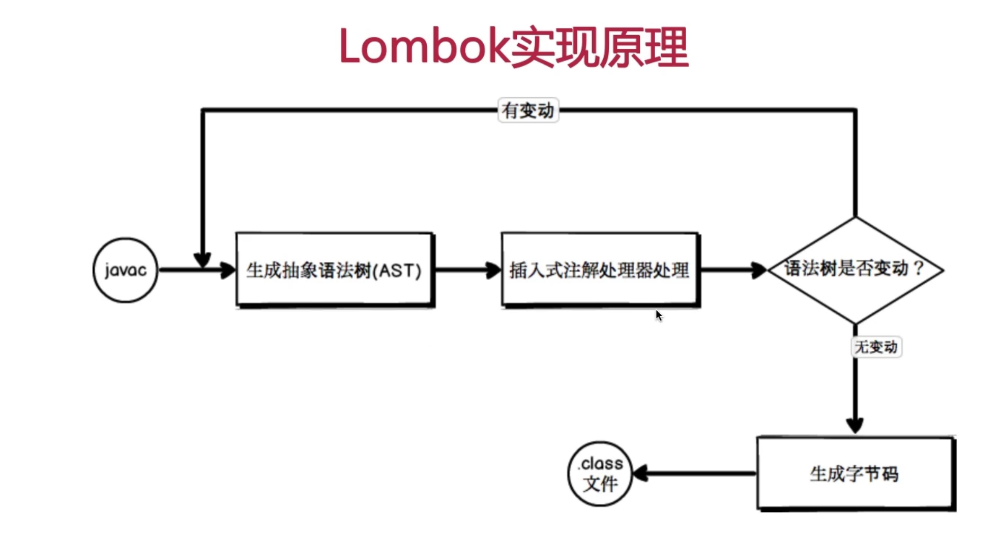
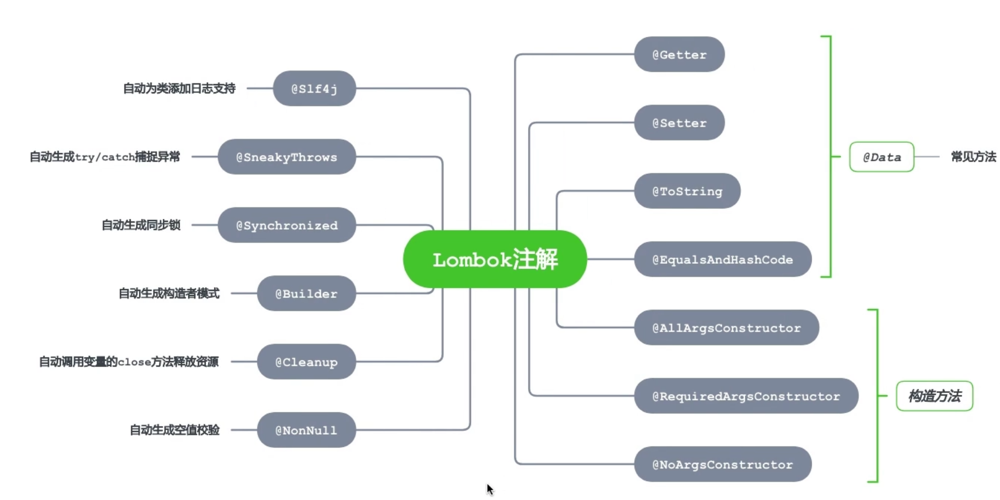
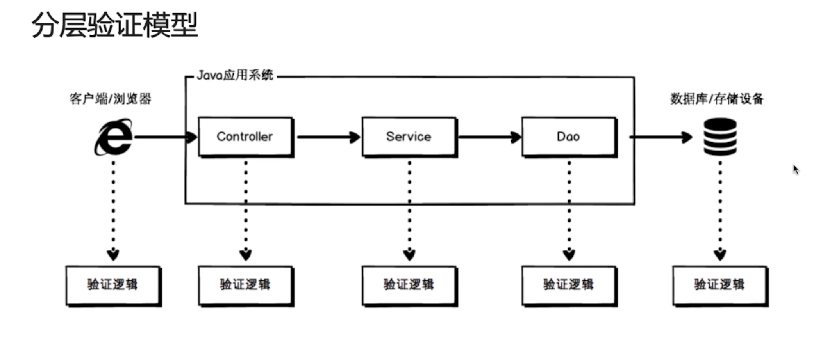
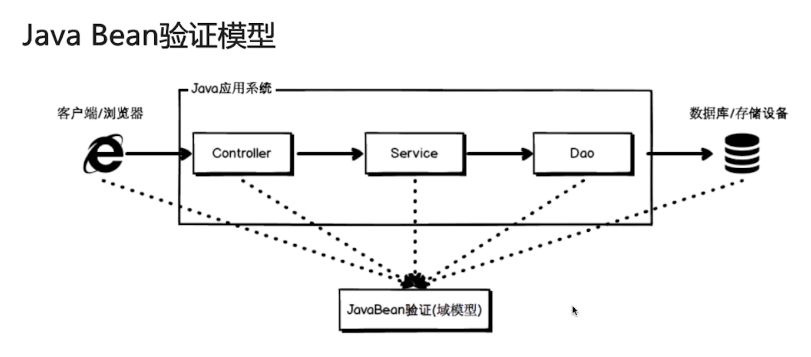
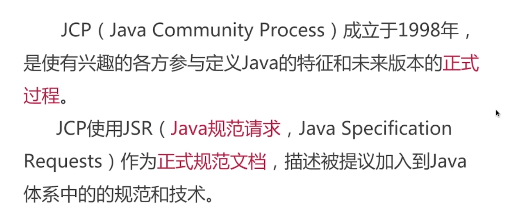
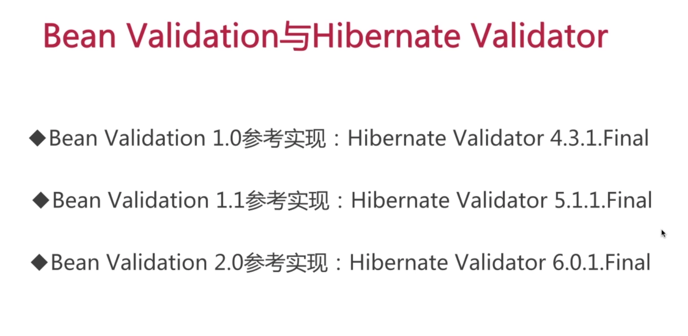
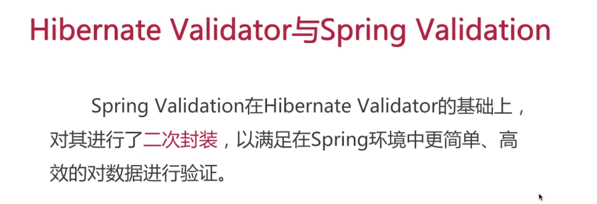
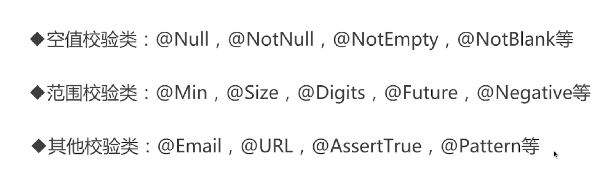

# 996study

## LAMBDA

### LAMBDA表达式简介

* Java8引入函数式编程风格
* 可以理解为一种匿名函数的替代
* 通过行为参数化传递代码

### LAMBDA表达形式


### 自定义函数式接口

* 规则要求

  接口只有一个抽象方法

### 常用函数式接口


### 方法引用




##  Stream流
* JDK1.8引入的新成员，以声明式方式处理集合数据
* 将基础操作链接起来，完成复杂的数据处理流水线
* 提供透明地并行处理
### 流的简介
* 从支持数据处理操作的源生成的元素序列
    * 元素序列：接口访问一组有序序列 
    * 源：集合
    * 数据处理：增删改查
    
* 流与集合的区别
    * 时间与空间
        集合空间 存储
        时间空间 计算
    * 只能遍历一次
        流只能遍历一次  
    * 外部迭代与内部迭代
    
 * 流的组成       
 

 * 流的分类
 
    

 * 流的使用
   
   * peek
   
     对流进行遍历操作，与foreach相似但不会销毁元素
   
   * 扁平化
    flatMap将一个对象转换为一个流（比如使用String.spliect），则会将一个字符串装换切割然后合并成一个流
   
   * 状态操作
   
      有状态的中间操作，会对无状态的操作的先后产生影响
   
   * findAny与findFirst
   
      any使用并行速度快点
   
   * 流的构建
   
      * 值
   
        ```java
        Stream.of(1,2,3,4,5);
        ```
   
      * 数组
   
        ```java
        int[] numbers = {1,2,3,4,5};
        Arrays.stream(numbers);
        ```
   
      * 文件
   
        ```java
        Stream<String> stream = Files.lines(Path.get(""));
        ```
   
      * 函数（无限流）
   
        ```java
        Stream.iterate(0, n -> n+2);
        Stream.generate(Math::random);
        ```
   
   *  流的收集
   
      * 将流中的元素累积成一个结果
      * 作用与终端collect（）上；
      * collect/Collector/Collectors
   
   * 预定义收集齐功能
   
      * 将元素规约和汇总为一个值
   
      * 将流元素分组
   
        
   
      * 将流元素分区
   
        
   
   
## 资源关闭

* GC特点

  

* 常见的需要手动释放的

  * 文件/流资源
  * 套接字
  * 数据库连接

* 物理资源可以不手动释放吗

  * 资源被长时间占用
  * 超过最大限制后，将无资源可用
  * 导致系统无法正常运行

* 新型流（1.8后）

  在try中声明流

* 总结

  

## Google Guava工具集

* 简介

  

  

* Option

  * 创建空的Option对象 Option.empty();

  * 非null  Option.of（“qqq”）；

  * 任意值  Option.ofNullable(null);

  * option.ifPresent();

  * option.orelse("引用缺失");

  * option.orElseGet(return "自定义异常");

  * option.orElseThrow(() -> {throw new RuntimeException("引用缺失异常")})

  * 解决集合null问题

    ```java
    Option.ofNullable(list)
    	.map(List::stream)
    	.orElseGet(Stream::empty)
    	.forEach(system.out::println);
    ```

  * 不可变集合

    

    

    

  * 新集合类型

    * Multiset

      

      

      

  * 集合工具类

    * sets

      并 差 叫 分解 笛卡尔积

    * Lists

      翻转 拆分

  * IO

    Files

    

    

    

## 线程池

  * 线程池简介

    

  * 好处

    * 降低资源消耗
    * 提供响应速度
    * 提高线程的可管理性

  * 简单线程池

    

    

  * 线程池的核心参数

    

  * 线程池的处理流程

    

  * 可选择的阻塞队列

    * 无界队列

      ArraylockingQuene

    * 有界队列

      LinkedBlockingQuene

    * 同步移交队列

      SynchronousQueue

  * 可选择的饱和策略

    

  * 执行示意图

    

  * 常用线程池

    * newCachedThreadPool

      

    * newFixedThreadPool

      

    * newSingleThreadExecutor

      
      
    * 线程池的状态
    
      
    
      
    

##  使用工具（Lombok）

* 简介

  

* 实现原理

  * 注解的两种解析方式
    * 运行时解析
    * 编译时解析
      * Annotation Processing Tool(注解处理器)
      * Pluggable Annotation Processing API(JSR269插入式注解处理器)
      * 

* 常用注解

  

* 相关注解

  注解内部可以添加参数  

  @val弱语言变量比如var根据值的情况进行推断

  @NonNull生成非空检查作用在方法上

  @Cleanup资源关闭

* Lombok优缺点

  * 优点
    * 通过注解自动生成样板代码，提高开发效率
    * 代码简洁，只关注相关属性
    * 新增属性后，无需刻意修改相关方法
  * 缺点
    * 降低了源代码的可读性和完整性
    * 加大对问题排查的难度
    * 需要IDE的相关插件支持

## 验证框架

* 分层验证与JavaBean验证

  

  

* Bean Validation简介

  为JavaBean验证定义了相对应的元数据模型和API

* JCP、JSR简介

  

  

  

* 常用约束注解

* 

* 相关校验注解代码

  * 实体类

  ```java
  package com.chenfeng.study996.study996.validate;
  
  import lombok.Data;
  import org.hibernate.validator.constraints.Length;
  
  import javax.validation.GroupSequence;
  import javax.validation.Valid;
  import javax.validation.constraints.*;
  import javax.validation.groups.Default;
  import java.util.Date;
  import java.util.List;
  
  /**
   * @Classname UserInfo
   * @Description TODO
   * @Date 2019/12/17 21:07
   * @Created by  wrsChen
   */
  @Data
  public class UserInfo {
  
      public interface LoginGroup {
  
      }
      public interface RegisterGroup {
  
      }
  
      /**
       * 组排序场景
       */
      @GroupSequence({
              LoginGroup.class,
              Readable.class,
              Default.class
      })
      public interface Group{
  
      }
  
      @NotNull(message = "用户id不能为空字符串")
      private String userId;
      @NotEmpty(message = "用户名称不能为空")
      private String userName;
      /**
       * 自动去除字符串的空格
       * */
      @NotBlank(message = "不能为空", groups = LoginGroup.class)
      @Length(min = 6,max=20,message = "密码不能小于6位大于20位")
      private String password;
      @Email(message = "邮箱格式不正确")
      private String email;
      @Min(value = 18, message = "不能小于18")
      @Max(value = 60, message = "不能超过60")
      private Integer age;
      private String phone;
      @Past(message = "不能是未来的时间点")
      private Date birthday;
      /**
       * @Valid 级联验证
       *
       */
      @Size(min = 1, message = "至少有一个元素")
      private List<@Valid UserInfo> friends;
  
  
  
  }
  
  ```

  * 服务类

    ```java
    package com.chenfeng.study996.study996.validate;
    
    import javax.validation.Valid;
    import java.security.PublicKey;
    
    /**
     * @Classname UserInfoService
     * @Description TODO
     * @Date 2019/12/17 21:50
     * @Created by  wrsChen
     */
    public class UserInfoService {
        public void setUseinfo(@Valid UserInfo useinfo) {
    
        }
    
        public UserInfo getUseinfo() {
            return new UserInfo();
        }
    
        public UserInfoService() {
    
        }
    
        public UserInfoService(@Valid UserInfo userInfo) {
    
        }
    
    
    
    }
    
    ```

  * 测试类

    ```java
    package com.chenfeng.study996.study996.validate;
    
    import org.junit.After;
    import org.junit.Before;
    import org.junit.Test;
    
    import javax.validation.ConstraintViolation;
    import javax.validation.Validation;
    import javax.validation.Validator;
    import javax.validation.executable.ExecutableValidator;
    import java.lang.reflect.Constructor;
    import java.lang.reflect.InvocationTargetException;
    import java.lang.reflect.Method;
    import java.util.Set;
    
    /**
     * @Classname ValidateTest
     * @Description TODO
     * @Date 2019/12/17 21:09
     * @Created by  wrsChen
     */
    public class ValidateTest {
        private Validator validator;
        private UserInfo userInfo;
        private Set<ConstraintViolation<UserInfo>> set;
        private Set<ConstraintViolation<UserInfoService>> otherSet;
    
        @Before
        public void init() {
            validator = Validation.buildDefaultValidatorFactory().getValidator();
            userInfo = new UserInfo();
        }
        @Test
        public void nullValidata(){
            set = validator.validate(userInfo);
        }
        @Test
        public void groupValidata() {
            set = validator.validate(userInfo, UserInfo.LoginGroup.class);
        }
    
        @Test
        public void groupSortValidata() {
            set = validator.validate(userInfo, UserInfo.Group.class);
        }
    
    
        @After
        public void print() {
            set.forEach(item -> System.out.println(item.getMessage()));
        }
    
        /**
         * 对参数进行检验
         */
        @Test
        public void paramValidation() throws NoSuchMethodException {
            ExecutableValidator executableValidator = validator.forExecutables();
            UserInfoService userInfoService = new UserInfoService();
            Method method = userInfoService.getClass().getMethod("setUseinfo", UserInfo.class);
           // 方法参数
            Object[] paramObjects = new Object[]{new UserInfo()};
            otherSet = executableValidator.validateParameters(
                    userInfoService,
                    method,
                    paramObjects
            );
        }
        /**
         * 对返回值进行检验
         */
        @Test
        public void returnValueValidation() throws NoSuchMethodException, InvocationTargetException, IllegalAccessException {
            ExecutableValidator executableValidator = validator.forExecutables();
            UserInfoService userInfoService = new UserInfoService();
            // 待验证方法
            Method method = userInfoService.getClass().getMethod("setUseinfo", UserInfo.class);
            // 调用方法拿到返回值
            Object returnValue = method.invoke(userInfoService);
            otherSet = executableValidator.validateReturnValue(
                    userInfoService,
                    method,
                    returnValue
            );
        }
    
        /**
         * 对返回值进行检验
         */
        @Test
        public void constructorValidation() throws NoSuchMethodException, InvocationTargetException, IllegalAccessException {
            ExecutableValidator executableValidator = validator.forExecutables();
            UserInfoService userInfoService = new UserInfoService();
            //
            Constructor constructor = UserInfoService.class.getConstructor(UserInfo.class);
            //
            Object[] param = new Object[]{new UserInfo()};
            otherSet = executableValidator.validateConstructorParameters(
                    constructor, param
            );
        }
    }
    
    ```

* 自定义注解

  * 注解类

    ```java
    package com.chenfeng.study996.study996.validate;
    
    import javax.validation.Constraint;
    import javax.validation.Payload;
    import java.lang.annotation.*;
    
    /**
     * @Classname Phone
     * @Description TODO
     * @Date 2019/12/17 22:15
     * @Created by  wrsChen
     */
    @Documented
    @Target({ElementType.FIELD})
    @Retention(RetentionPolicy.RUNTIME)
    @Constraint(validatedBy = PhoneValidator.class)
    
    public @interface Phone {
        String message() default "手机号出现错误";
        Class<?>[] groups() default {};
        Class<? extends Payload>[] payload() default {};
    }
    
    ```

  * 注解实现

    ```java
    package com.chenfeng.study996.study996.validate;
    
    import javax.validation.ConstraintValidator;
    import javax.validation.ConstraintValidatorContext;
    
    /**
     * @Classname PhoneValidator
     * @Description TODO
     * @Date 2019/12/17 22:19
     * @Created by  wrsChen
     */
    public class PhoneValidator implements ConstraintValidator<Phone, String> {
       public void initialize(Phone constraint) {
       }
    
       public boolean isValid(String obj, ConstraintValidatorContext context) {
        //处理规则
        return false;
       }
    }
    
    ```

    

​    


