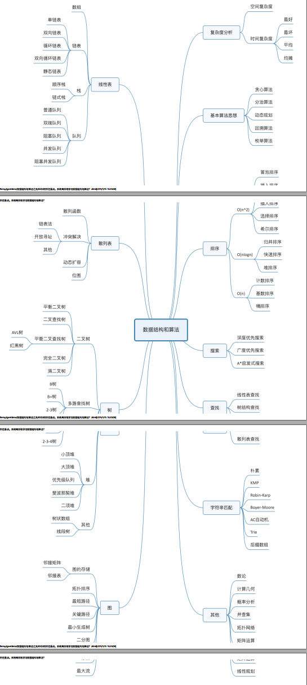
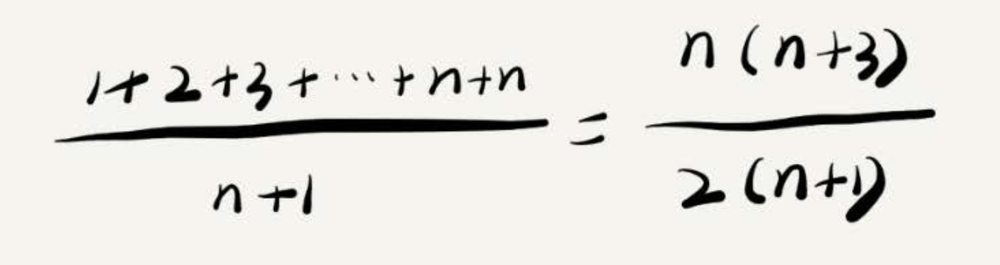
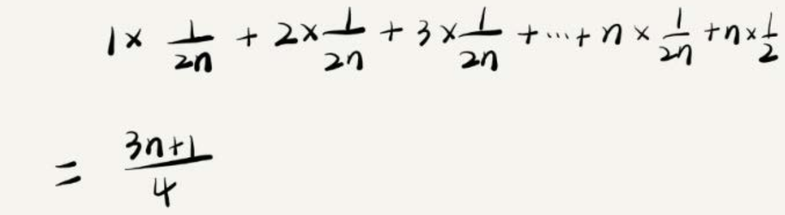
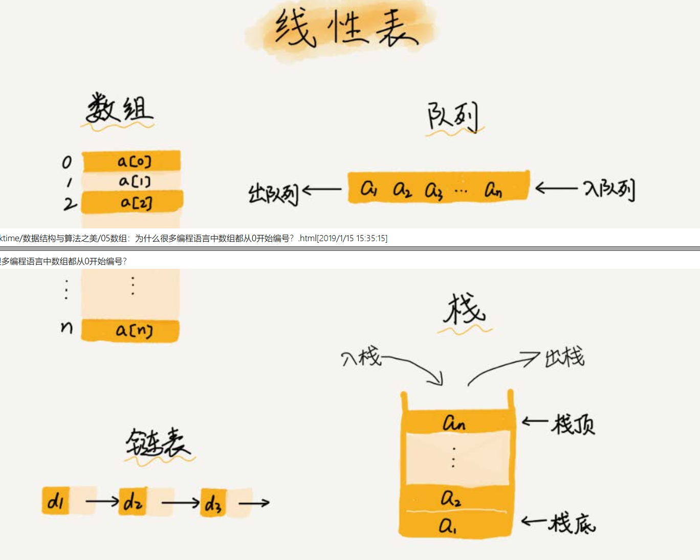
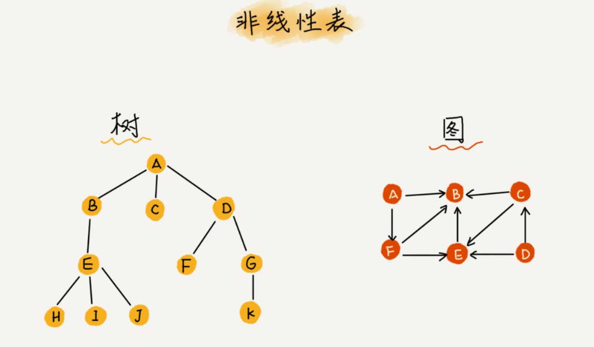
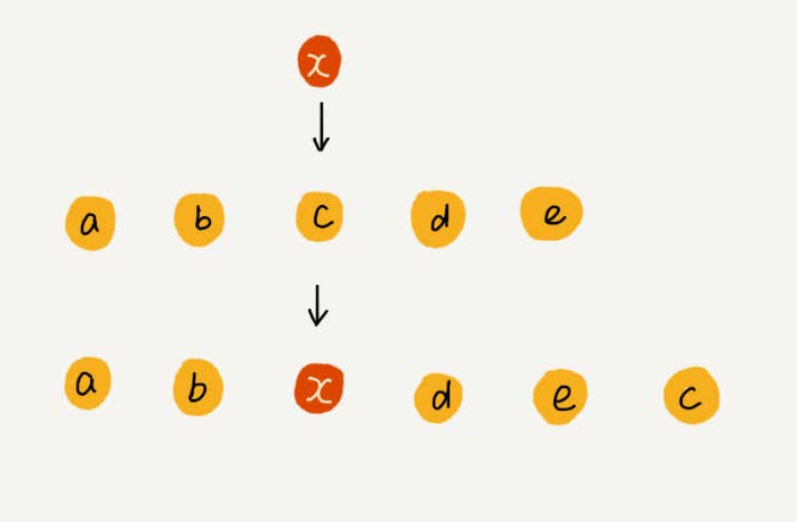
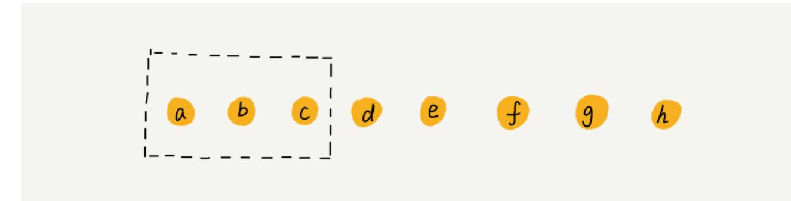

# 数据结构与算法之美


## 复杂度分析（下）：浅析最好、最坏、平均、均摊时间复杂度

```java
// n表示数组array的长度
int find(int[] array, int n, int x) {
int i = 0;
int pos = -1;
for (; i < n; ++i) {
if (array[i] == x) {
pos = i;
break;
}
}
return pos;
}
```

* 最好情况时间复杂度（best case time complexity） 

   如上所述代码最好的情况就是x正好是数组的第一个元素

* 最坏情况时间复杂度（worst case time complexity）  

  如上所述最坏的情况就是第n个元素

* 平均情况时间复杂度（average case time complexity）

  最好情况时间复杂度和最坏情况时间复杂度对应的都是极端情况下的代码复杂度，发生的概率其实并不大。为了更好地表示平均情况下的复杂度，
  我们需要引入另一个概念：平均情况时间复杂度  

    要查找的变量x在数组中的位置，有n+1种情况： 在数组的0～ n-1位置中和不在数组中。我们把每种情况下，查找需要遍历的元素个数累加起来，然后再除以n+1，
  就可以得到需要遍历的元素个数的平均值，即：  

  

  这个结论虽然是正确的，但是计算过程稍微有点儿问题。究竟是什么问题呢？我们刚讲的这n+1种情况，出现的概率并不是一样的。我带你具体分析一下。（这里
  要稍微用到一点儿概率论的知识，不过非常简单，你不用担心。）
  我们知道，要查找的变量x，要么在数组里，要么就不在数组里。这两种情况对应的概率统计起来很麻烦，为了方便你理解，我们假设在数组中与不在数组中的概
  率都为1/2。另外，要查找的数据出现在0～ n-1这n个位置的概率也是一样的，为1/n。所以，根据概率乘法法则，要查找的数据出现在0～ n-1中任意位置的概率就
  是1/(2n)。
  因此，前面的推导过程中存在的最大问题就是，没有将各种情况发生的概率考虑进去。如果我们把每种情况发生的概率也考虑进去，那平均时间复杂度的计算过
  程就变成了这样：

   

  

* 均摊时间复杂度（amortized time complexity）  

  对一个数据结构进行一组连续操作中，大部分情况下时间复杂度都很低，只有个别情况下时间复杂度比较高，而且这些操作之间存在前后连贯的时序关系，这个
  时候，我们就可以将这一组操作放在一块儿分析，看是否能将较高时间复杂度那次操作的耗时，平摊到其他那些时间复杂度比较低的操作上。而且，在能够应用均摊时间复杂度分析的场合，一般均摊时间复杂度就等于最好情况时间复杂度。
  尽管很多数据结构和算法书籍都花了很大力气来区分平均时间复杂度和均摊时间复杂度，但其实我个人认为， 均摊时间复杂度就是一种特殊的平均时间复杂度，
  我们没必要花太多精力去区分它们。你最应该掌握的是它的分析方法，摊还分析。至于分析出来的结果是叫平均还是叫均摊，这只是个说法，并不重要。  

## 数组：为什么很多编程语言中数组都从0开始编号

* 什么是数组

  * 线性表

    是一种线性表数据结构。它用一组连续的内存空间，来存储一组具有相同类型的数据  。

    * 线性表

      线性表就是数据排成像一条线一样的结构。每个线性表上的数据最多只有前和后两个方向。其实除了数组，链表、队列、栈等也是线性表结构。  

      

    * 非线性表

      比如二叉树、堆、图等。之所以叫非线性，是因为，在非线性表中，数据之间并不是简单的前后关系。  

      

      

  * 连续的内存空间和相同类型的数据结构

    正是因为这两个限制，它才有了一个堪称“杀手锏”的特性： “随机访问”。但有利就有弊，这两个限制也让数组的很多
    操作变得非常低效，比如要想在数组中删除、插入一个数据，为了保证连续性，就需要做大量的数据搬移工作。  

    

    其中base_adress = 1000

    它会首先通过下面的寻址公式，计算出该元素存储的内存地址：
    a[i]_address = base_address + i * data_type_size（每个类型占据的大小）  

    数组是适合查找操作，但是查找的时间复杂度并不为O(1)。即便是排好序的数组，你用二分查找，时间复杂度也是O(logn)。所
    以，正确的表述应该是，数组支持随机访问，根据下标随机访问的时间复杂度为O(1)。  

* 低效的插入和删除

  如果考虑到后面的元素顺序不变，则效率是比较低的

  特定场景下将元素x插入到第3个位置。我们只需要将c放入到a[5]，将a[2]赋值为x即可。最后，数组中的元素如下： a， b， x， d， e， c。  复杂低n（1）

  

  跟插入数据类似，如果我们要删除第k个位置的数据，为了内存的连续性，也需要搬移数据，不然中间就会出现空洞，内存就不连续了。
  和插入类似，如果删除数组末尾的数据，则最好情况时间复杂度为O(1)；如果删除开头的数据，则最坏情况时间复杂度为O(n)；平均情况时间复杂度也为O(n)。
  实际上，在某些特殊场景下，我们并不一定非得追求数组中数据的连续性。如果我们将多次删除操作集中在一起执行，删除的效率是不是会提高很多呢？
  我们继续来看例子。数组a[10]中存储了8个元素： a， b， c， d， e， f， g， h。现在，我们要依次删除a， b， c三个元素。  

  

  为了避免d， e， f， g， h这几个数据会被搬移三次，我们可以先记录下已经删除的数据。每次的删除操作并不是真正地搬移数据，只是记录数据已经被删除。当数
  组没有更多空间存储数据时，我们再触发执行一次真正的删除操作，这样就大大减少了删除操作导致的数据搬移。
  如果你了解JVM，你会发现，这不就是JVM标记清除垃圾回收算法的核心思想吗？没错，数据结构和算法的魅力就在于此， 很多时候我们并不是要去死记硬背某
  个数据结构或者算法，而是要学习它背后的思想和处理技巧，这些东西才是最有价值的。如果你细心留意，不管是在软件开发还是架构设计中，总能找到某些算
  法和数据结构的影子。  

* 数组和链表的选择

  * .Java ArrayList无法存储基本类型，比如int、 long，需要封装为Integer、 Long类，而Autoboxing、 Unboxing则有一定的性能消耗，所以如果特别关注性能，或者希
    望使用基本类型，就可以选用数组。
  * .如果数据大小事先已知，并且对数据的操作非常简单，用不到ArrayList提供的大部分方法，也可以直接使用数组。
  * .还有一个是我个人的喜好，当要表示多维数组时，用数组往往会更加直观。比如Object[][] array；而用容器的话则需要这样定义： ArrayList<ArrayList > array。
  * 我总结一下，对于业务开发，直接使用容器就足够了，省时省力。毕竟损耗一丢丢性能，完全不会影响到系统整体的性能。但如果你是做一些非常底层的开发，
  * 比如开发网络框架，性能的优化需要做到极致，这个时候数组就会优于容器，成为首选。  

* 解答开篇
  现在我们来思考开篇的问题：为什么大多数编程语言中，数组要从0开始编号，而不是从1开始呢？
  从数组存储的内存模型上来看， “下标”最确切的定义应该是“偏移（offset） ”。前面也讲到，如果用a来表示数组的首地址， a[0]就是偏移为0的位置，也就是首地
  址， a[k]就表示偏移k个type_size的位置，所以计算a[k]的内存地址只需要用这个公式：
  a[k]_address = base_address + k * type_size
  但是，如果数组从1开始计数，那我们计算数组元素a[k]的内存地址就会变为：
  a[k]_address = base_address + (k-1)*type_size
  对比两个公式，我们不难发现，从1开始编号，每次随机访问数组元素都多了一次减法运算，对于CPU来说，就是多了一次减法指令。
  数组作为非常基础的数据结构，通过下标随机访问数组元素又是其非常基础的编程操作，效率的优化就要尽可能做到极致。所以为了减少一次减法操作，数组选
  择了从0开始编号，而不是从1开始。
  不过我认为，上面解释得再多其实都算不上压倒性的证明，说数组起始编号非0开始不可。所以我觉得最主要的原因可能是历史原因。
  C语言设计者用0开始计数数组下标，之后的Java、 JavaScript等高级语言都效仿了C语言，或者说，为了在一定程度上减少C语言程序员学习Java的学习成本，因此
  继续沿用了从0开始计数的习惯。实际上，很多语言中数组也并不是从0开始计数的，比如Matlab。甚至还有一些语言支持负数下标，比如Python。

* 内容小结  

  我们今天学习了数组。它可以说是最基础、最简单的数据结构了。数组用一块连续的内存空间，来存储相同类型的一组数据，最大的特点就是支持随机访问，但
  插入、删除操作也因此变得比较低效，平均情况时间复杂度为O(n)。在平时的业务开发中，我们可以直接使用编程语言提供的容器类，但是，如果是特别底层的
  开发，直接使用数组可能会更合适。
  课后思考
  \1. 前面我基于数组的原理引出JVM的标记清除垃圾回收算法的核心理念。我不知道你是否使用Java语言，理解JVM，如果你熟悉，可以在评论区回顾下你理解
  的标记清除垃圾回收算法。
  \2. 前面我们讲到一维数组的内存寻址公式，那你可以思考一下，类比一下，二维数组的内存寻址公式是怎样的呢？  

* JVM标记清除算法：
  大多数主流虚拟机采用可达性分析算法来判断对象是否存活，在标记阶段，会遍历所有 GC ROOTS，将所有 GC ROOTS 可达的对象标记为存活。只有当标记工作完成后，清理工作才会开始。
  不足： 1.效率问题。标记和清理效率都不高，但是当知道只有少量垃圾产生时会很高效。 2.空间问题。会产生不连续的内存空间碎片。
  二维数组内存寻址：
  对于 m * n 的数组， a [ i ][ j ] (i < m,j < n)的地址为：
  address = base_address + ( i * n + j) * type_size
  另外，对于数组访问越界造成无限循环，我理解是编译器的问题，对于不同的编译器，在内存分配时，会按照内存地址递增或递减的方式进行分配。老师的
  程序，如果是内存地址递减的方式，就会造成无限循环  