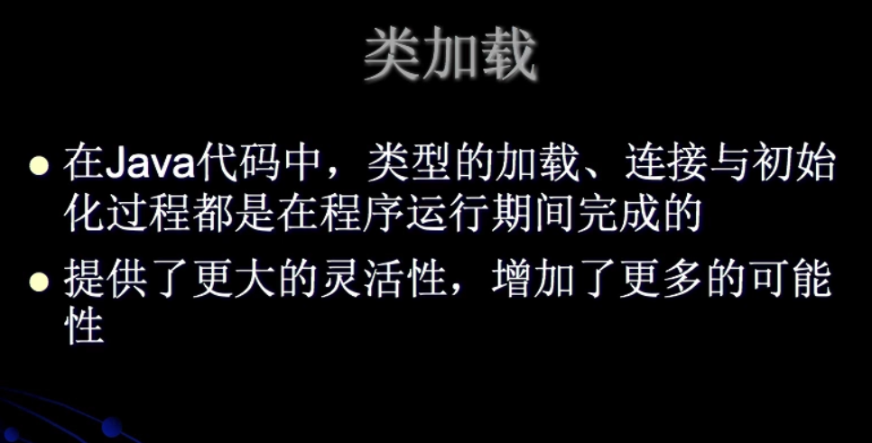
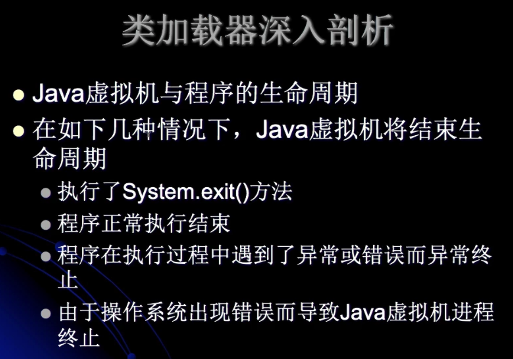
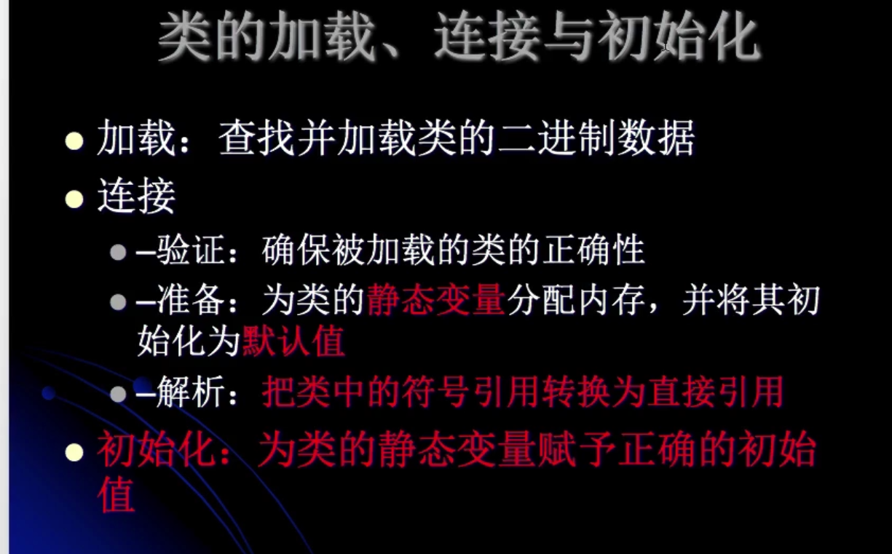
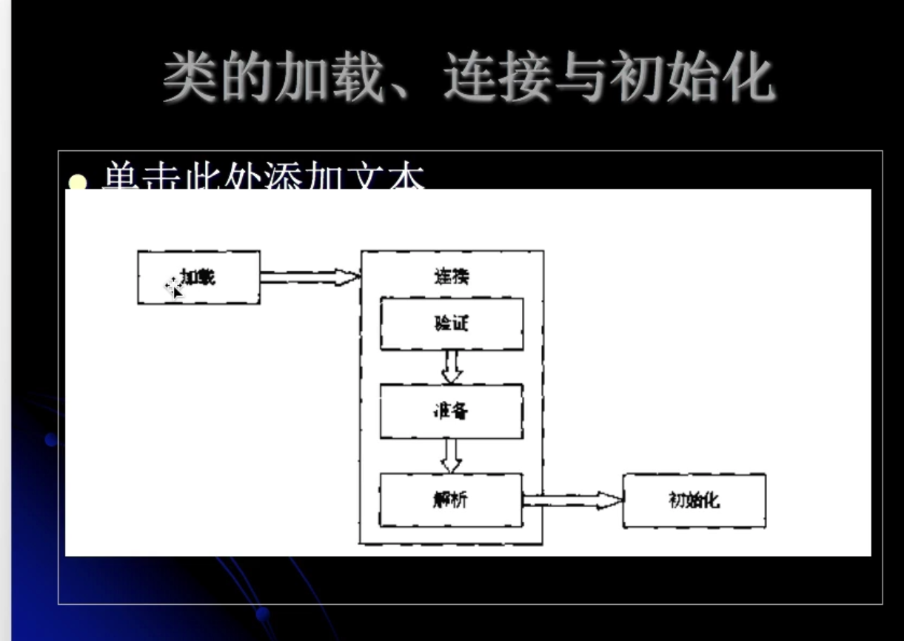
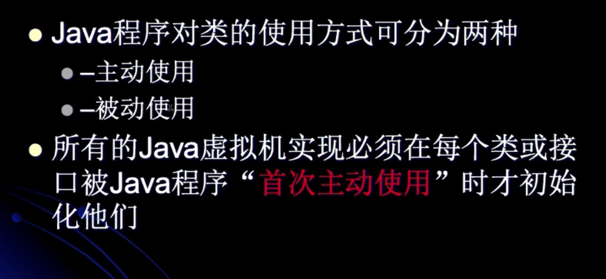
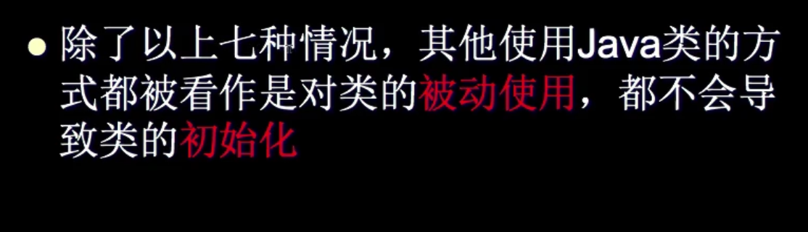
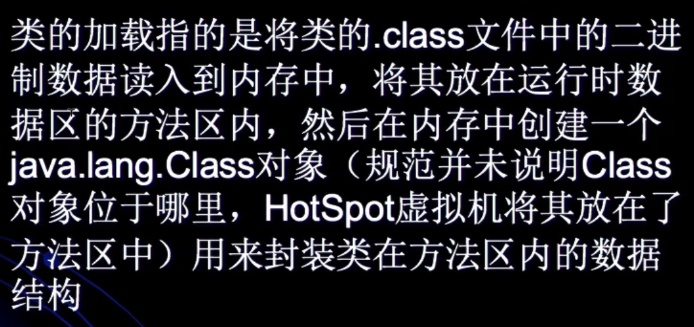
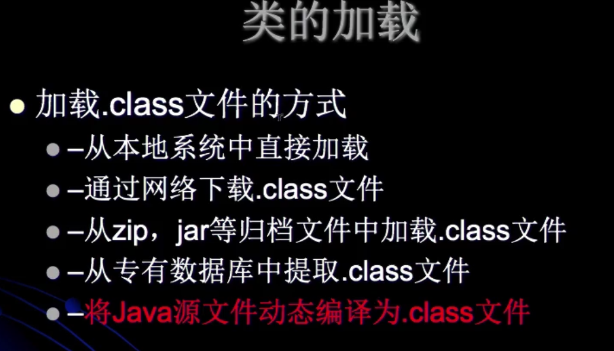
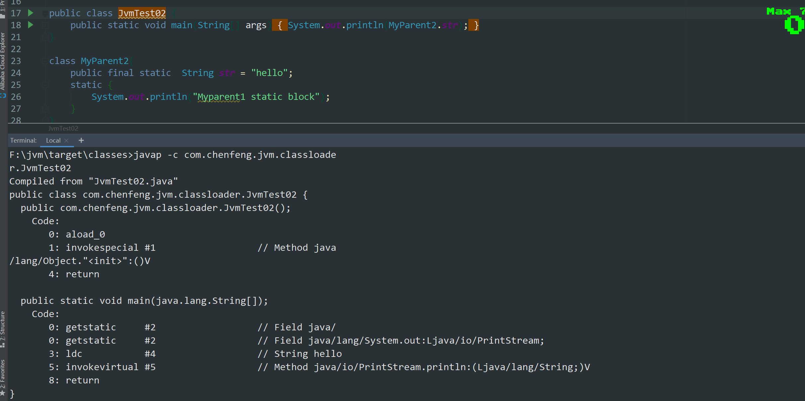
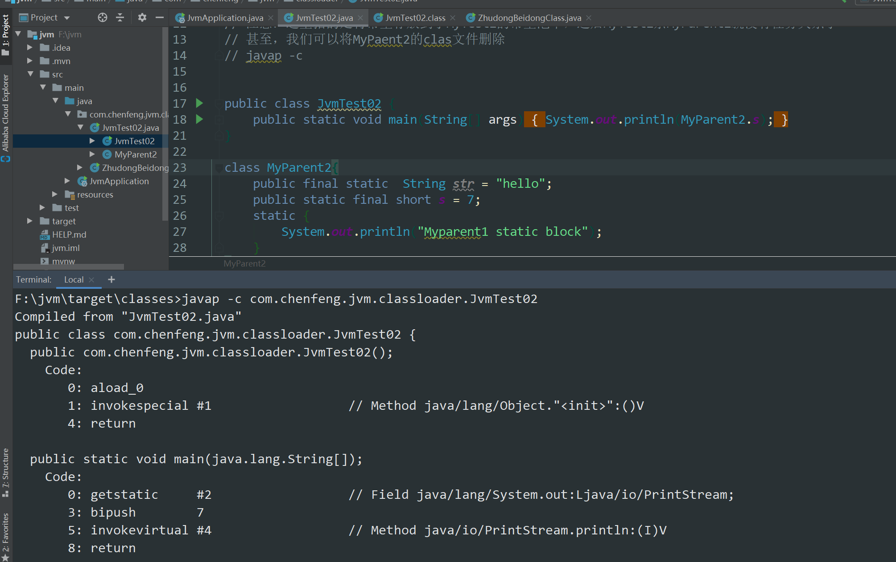

# JVM学习

## 如何学习JVM

* 普通的框架模仿
* 枯燥的
* 实战难以实现
* 涵盖东西多
* 讲解
  * JVM通用的
  * 相关参数
* 学习方法
  * 要记笔记
  * 有节奏，有计划的学习
  * R大
  * 产生一些迷茫，什么都用不到
  * 不会的东西越来越多
  * 学完就忘（记下来不断回顾）

## 深入理解JVM课程

* 编译成字节码文件都可以在jvm平台上运行

## 类加载器深入解析与阶段分解

* 类加载

  

  * 类型（不是对象）runTime时期

    * 类

    * 接口
    *  枚举

    （根据类型的信息把类在堆上创建出来）

  * 加载

    校验（常见）已经编译好的class文件从硬盘上加载在内存上

  * 初始化

    比如静态变量的赋值

    并不一定是按照顺序来的

* 类加载器深入剖析

  

  * 每一个类型都是由类加载器加载到内存中的

  

  

  ```java
  public static int a = 1;
  // (准备阶段加载到内存，先赋默认值值为0)
  // （初始化解阶段，赋值为1）
  // 符号引用 间接的引用 通过符号 表示来去
  // 直接引用 通过指针的方式执行内存中的位置
  ```

* 类的使用与卸载

  Xshot-0069.png

  * 使用 跟我们接触最多的
  * 卸载  从内存中卸载osgi 

## 类的加载连接与初始化详解

* 加载、连接与初始化



* 类的使用

  

  * 初始化一次

  * 主动使用

    * 创建类的实例

    * 静态

      * 访问某个类或接口的静态变量，或者对该静态变量赋值
      * 调用类的静态方法（反应到字节码的助记符是差不多的）
      * getstatic
      * putstatic
      * invokestatic
	  
	* 反射
	
	* 初始化一个类的子类
	
	* java虚拟机启动时被标明为启动类的类的类
	
	* JDK1.7开始提供的动态语言支持
	
	  
	
	* 被动使用
	
	  
	

  * 类的加载1

    

* 类的加载2

  

  * 动态代理

* 被动使用与被动使用的关系

##  常量的本质含义与反编译助记符

* 代碼

  ```java
  package com.chenfeng.jvm.classloader;
  
  /**
   * @Classname JvmTest02
   * @Description TODO
   * @Date 2019/12/18 22:25
   * @Created by  wrsChen
   */
  // 常量在编译阶段会存入到调用这个常量的方法所在类的常量池中
  // 本质上，调用类并没有直接引用到定义常量的类，因此并不会触发
  // 定义常量的类的初始化
  // 注意：这里指的是将常量存放到了MyTest2的常量池中，之后MyTest2余MyParent2就没有任务关系了
  // 甚至，我们可以将MyPaent2的clas文件删除
  // javap -c
  
  
  public class JvmTest02 {
      public static void main(String[] args) {
          System.out.println(MyParent2.i);
      }
  }
  
  class MyParent2{
      public final static  String str = "hello";
      public static final short s = 7;
      public static final int  i = 128;
      static {
          System.out.println("Myparent1 static block");
      }
  }
  ```

  ```java
  package com.chenfeng.jvm.classloader;
  
  /**
   * @Classname ZhudongBeidongClass
   * @Description TODO
   * @Date 2019/12/18 21:43
   * @Created by  wrsChen
   */
  public class ZhudongBeidongClass {
      // 对于静态字段来说，只有直接定义了该字段的类才会被初始化 （主动使用MyParent1）
      // 当一个类在初始化时，要求其父类全部都已经初始化完毕了
      // -XX:+TranceClassLoading, 用于追踪类的加载信息并打印出来
      // -XX:+<option> 表示开启option选项
      // -XX:-<option> 表示关闭option选项
      // -XX:<option>=<value> 表示将option选项的值设置为value
      public static void main(String[] args) {
          //System.out.println(MyChild1.str2);
          System.out.println(MyChild1.str);
  
      }
  }
  
  class MyParent1{
      public static  String str = "hello";
      static {
          System.out.println("Myparent1 static block");
      }
  }
  
  class MyChild1 extends MyParent1{
      public static String str2 = "welwchilder";
      static {
          System.out.println("mychildren block");
      }
  }
  
  ```

  

* 助记符

  * ldc

    表示将int，float或是String类型的常量值从常量池中推送到栈顶

  * bipush

    表示将单字节（-128-127）的常量池推送到栈顶

  * sipush

    表示将一个短整型常量值（-32768-32767）推送至栈顶

  * iconst_1表示将int类型1推送至栈顶

    iconst_m1 - iconst_5
    
    在rt.jar包中都有相关的类

  下面的代码是class文件

  

  

  


## 编译器常量与运行期常量的区别以及数组创建的本质分析

* 助记符
  * anewarray: 表示创建一个引用类型的（如类、接口、数组）数组，并将其值压入栈顶
  * newarray: 表示创建一个指定的原始类型（如int，float，char）的数组，并将其引用值压入栈顶

```java
package com.chenfeng.jvm.classloader;

import java.util.UUID;

/**
 * @Classname Mytest3
 * @Description TODO
 * @Date 2019/12/19 23:06
 * @Created by  wrsChen
 */
// 2.4 18:44

//  编译器能否确定下来
// 在编译器不能确定下来的常量的值，那么久值久不会被放到调用类的常量池中
//  这时在程序运行时，会导致主动使用这个常量所在的类，显然会到这这个类被初始化

public class MyTest3 {
    public static void main(String[] args) {
        System.out.println(MyParent3.str);
    }
}

class MyParent3{
    public static final String str = UUID.randomUUID().toString();
    static {
        System.out.println("MyParent3");
    }


}


```

```java
package com.chenfeng.jvm.classloader;

/**
 * @Classname MyParent4
 * @Description TODO
 * @Date 2019/12/19 23:28
 * @Created by  wrsChen
 */
/** 对于数组实例来说，其类型是由JVM在运行期动态生成的
 *  表示为[Lcom.chenfeng.classload.MyTest4这种形式、
 *  动态生成的类型其父类型就是Object
 *  对于数组来说，JavaDoc经常将构成数组的元素为component，实际上就是将数组降低一个维度后的类型
 *
 */
public class MyTest4 {
    public static void main(String[] args) {

        //MyParent4 myParent4 = new MyParent4();
        MyParent4[] myParent5 = new MyParent4[1];
        // 在运行期创建出来的
        System.out.println(myParent5.getClass());
        // 组件
        MyParent4[][] myParent6 = new MyParent4[1][1];
        System.out.println(myParent6.getClass());
        System.out.println("======");
        int[] ints = new int[1];
        System.out.println(ints.getClass());
        System.out.println(ints.getClass().getSuperclass());
    }

}
class MyParent4{
    static {
        System.out.println("MyParent4 static clock");
    }

}

```


