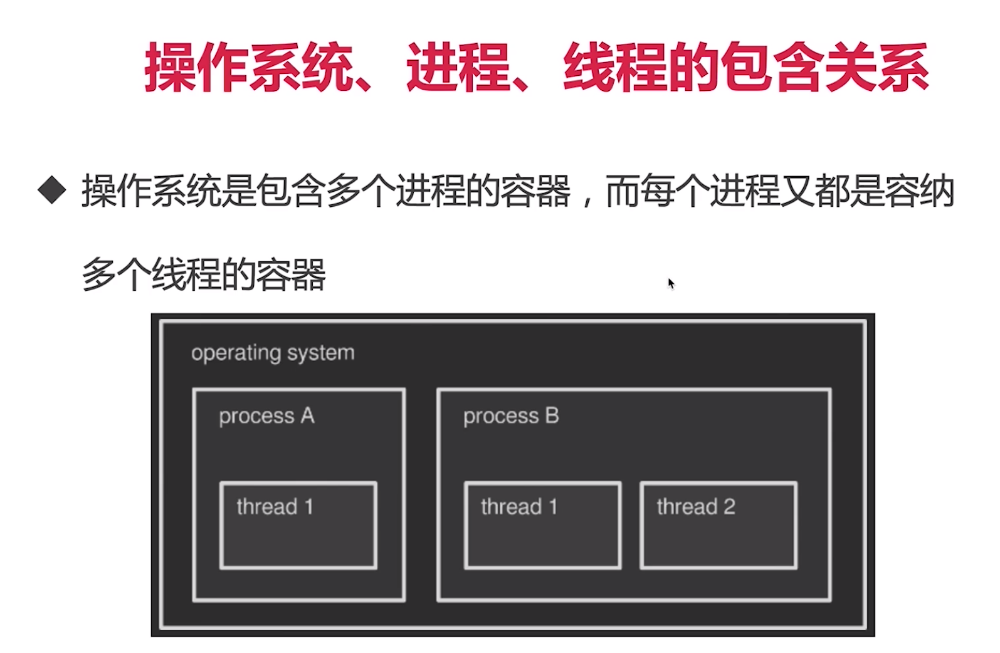
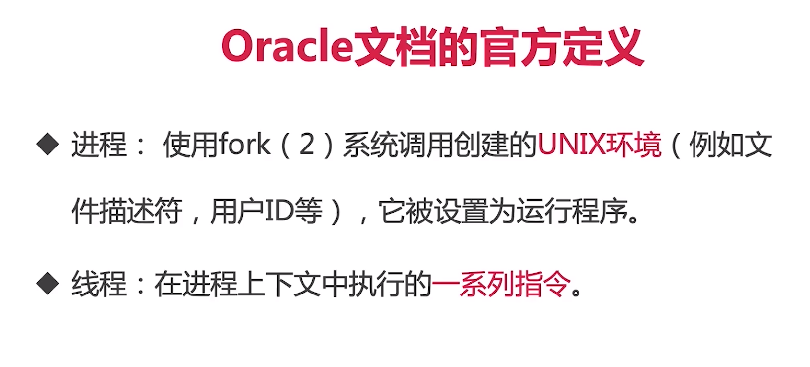
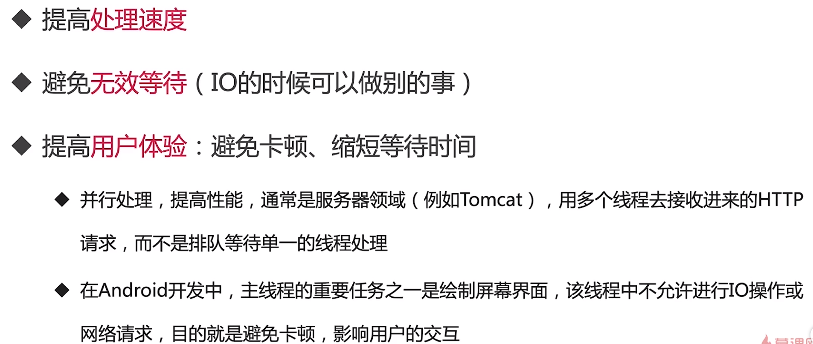
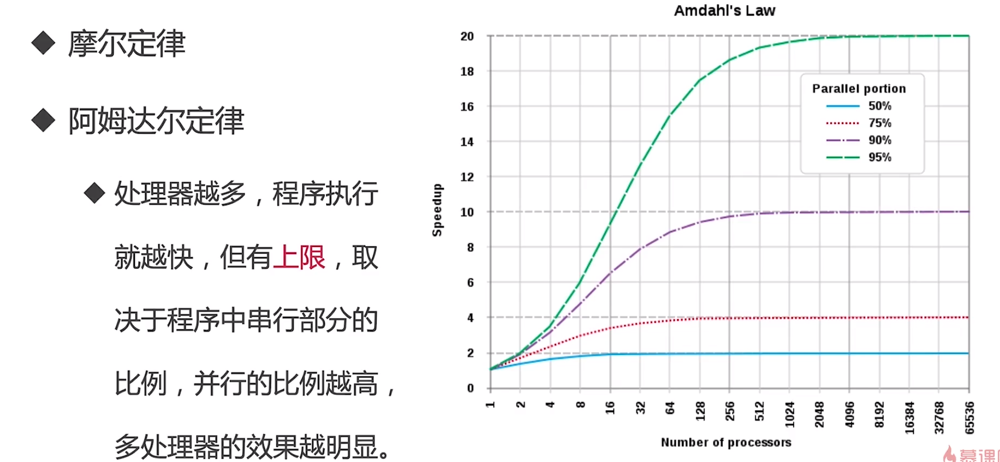
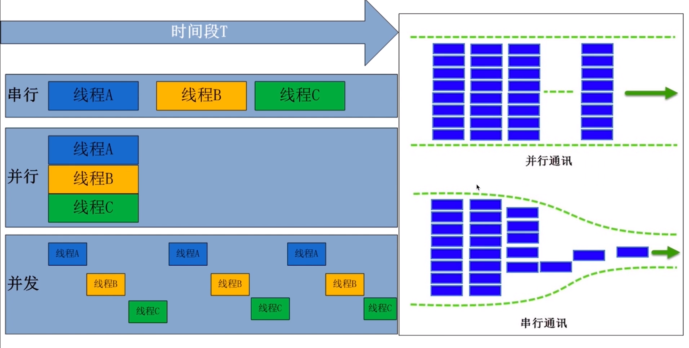
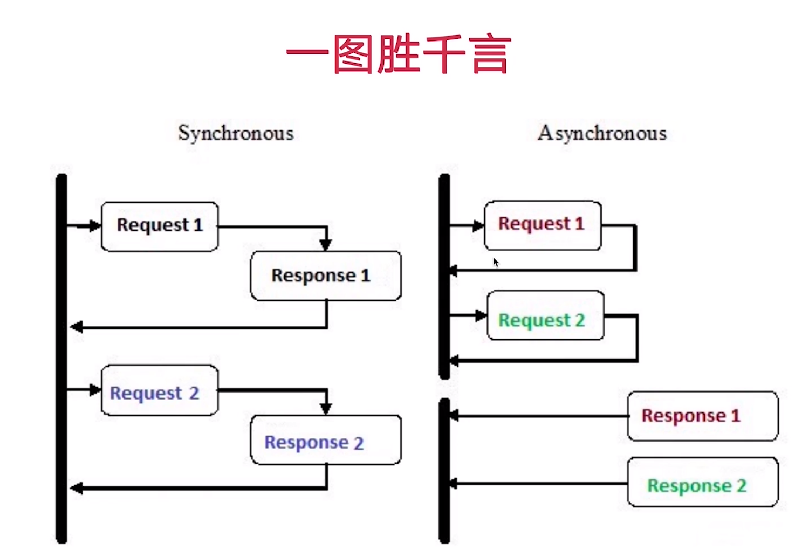

# 多线程概念建立

## 什么是线程

## 进程和线程的不同

* 起源不同

  cpu的处理速度比外设快，为了提高cpu的执行速度

  先有进程后有线程，为了提高cpu利用率。

* 概念不同

  进程是程序运行起来的独立活动，是一个实例，是系统分配资源和调度资源独立单位，线程是cpu调度的独立单位

* 内存共享方式

  进程共享很难，需要一些特殊处理

* 拥有资源不同

  * 共享内容包括
    * 进程代码
    * 进程的公园数据
    * 打开的文件描述符
    * 信号处理器
    * 进程的当前目录
    * 用户ID与进程组ID
  * 线程独有的
    * 线程id
    * 寄存器组的值
    * 线程的堆栈
    * 错误返回码
    * 线程的信号屏蔽码

* 数量不同

* 开销不同

  * 线程的创建、终止时间比进程短
  * 同一进程内的线程切换时间比进程切换短
  * 同一进程的各个线程间共享内存和文件资源，可以不通过内核进行通信

### 相同

在状态上非常相似的

# 多线程

## java语言和多线程的渊源和关系

* java设计之初----支持多线程
* 在后端的定位----长居前三
* 一对一映射到操作系统的内核线程
* jvm自动启动线程
  * SignalDispatch 操作系统发来的信号分发给适当的处理程序
  * Finalizer 负责对象的finalize（）方法
  * Reference Handle 和GC引用相关的线程
  * main 主线程，用户程序的入口

##  什么是多线程

多线程实例：抢火车

资源共享的任务
## 为什么需要多线程

* 便于编建模

* 计算机定律：阿姆达尔定律

  

* 那些场景会用到

  * 什么时候需要新开线程
    * 同事做多件不同的事
    * 为了提高工作效率、处理能力
    * 需要同时有很大并发量的时候

* 局限

  * 性能问题：上下文切换带来的消耗
  * 异构化任务（任务结构不一样）
  * 线程安全：死锁、线程饥饿

  

## 串行、并性、并发

* 串行和并行

  

* 并发和并行

  * 并发
  	
  	
  	
  	
  	
  * 并行 

    

* 是什么让并发和并行成为可能

  * cpu升级
  * 操作系统升级
  * 编程语言升级

  ## 高并发

  ## 什么是高并发

  ## 高并发和多线程的联系和不同
	 	一种解决方案

  ## 高并发有哪些指标

  

并发连接数

服务器平均请求等待时间

同步阻塞

同步非阻塞

异步阻塞

异步非阻塞

