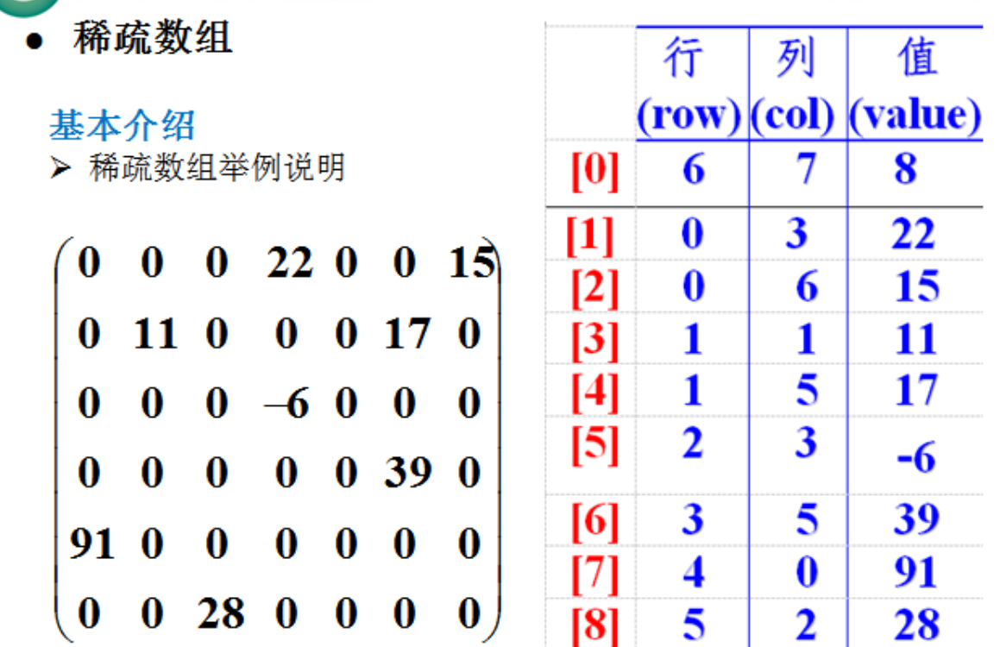
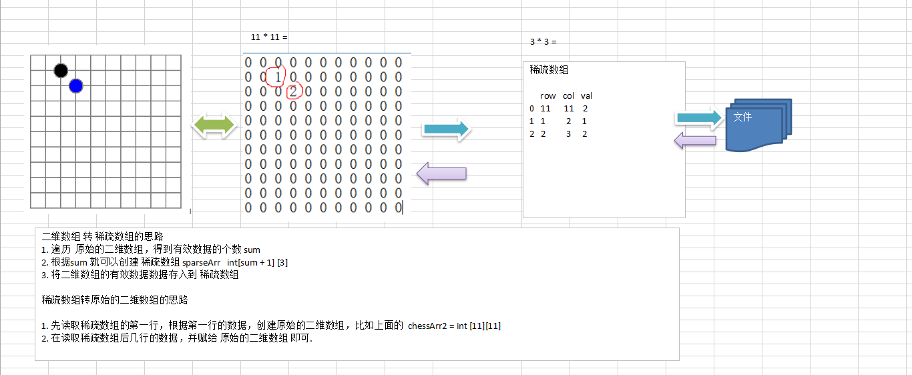

# 数据结构与算法
* 数据结构是一门研究组织数据方式的学科
* 学好数据结构的关键是将现实生活遇到的问题使用程序去解决
* 程序 = 数据结构 + 算法

## 线性结构和非线性结构

### 线性结构

* 元素之间存在一对一的线性关系
* 两种存储结构：顺序存储、链式结构，顺序存储的线性表又称为顺序表，顺序表中的存储元素是连续的
* 链式存储的表称为链表，链表中的存储元素不一定是连续的，元素节点中反方数据源元素一记相邻元素的地址信息
* 线性表中常见的结构有：数组、队列、链表、栈

### 非线性结构

* 非线性结构包括：二维数组、多维数组、广义表、树结构、图结构

 ## 线性结构

### 稀疏数组

* **基本介绍**

  当一个数组中大部分元素为0，或者为同一个值的数组时，可以用稀疏数组来保存该数组

* **稀疏数组的处理方式**

  * 记录数组有一共有几行几列，有多少个不同的值
  * 把具有不同值的元素的行列记录在一个小规模的数组中，从而缩小程序的规模

* 图示

  

* **转换思路**

  

  

* 

