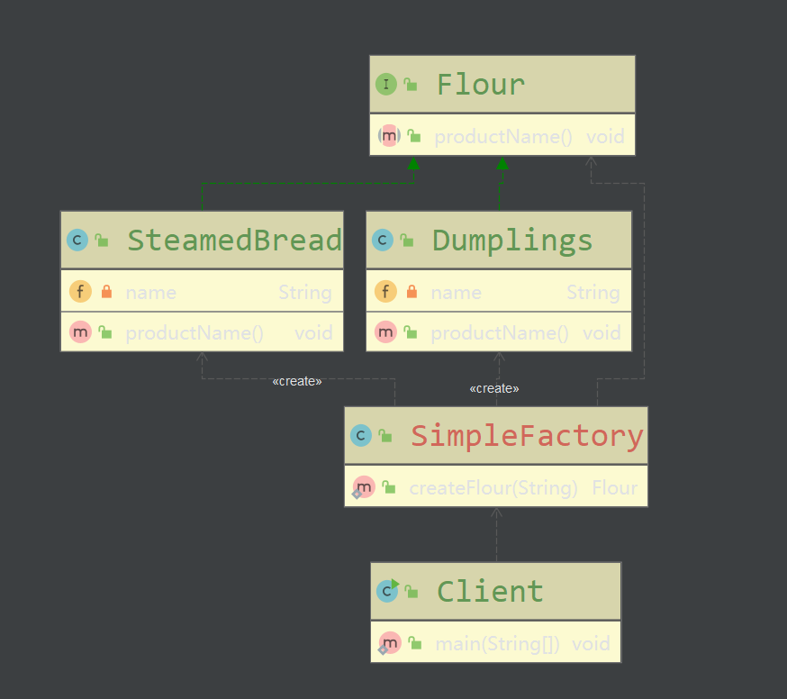
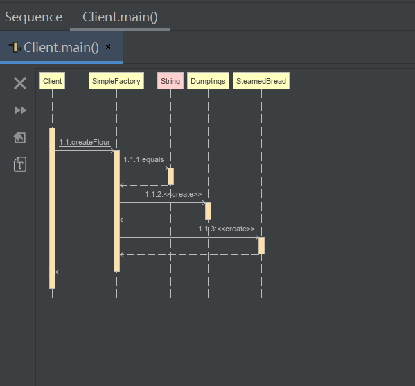
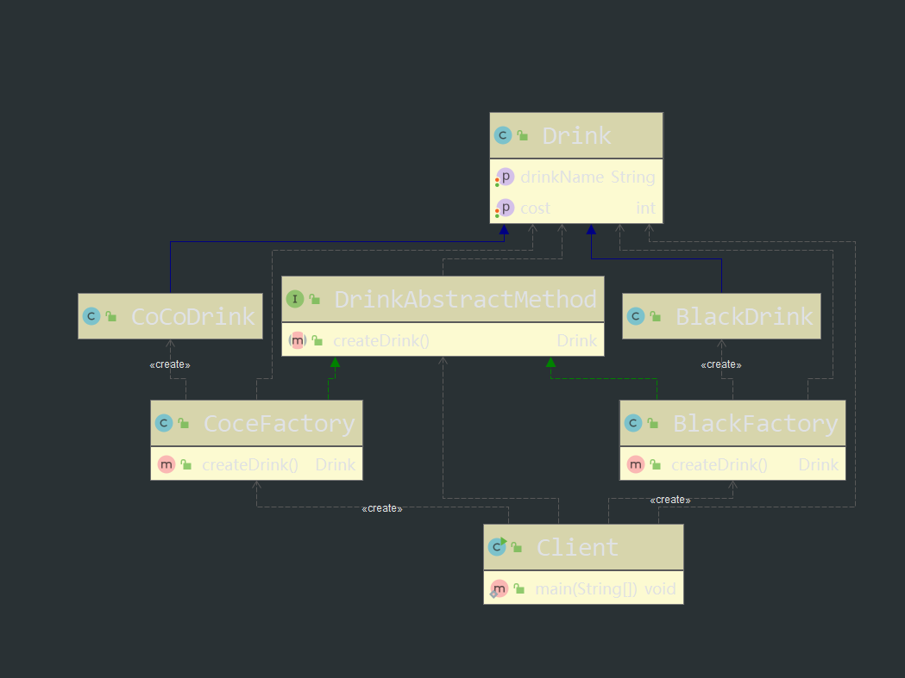
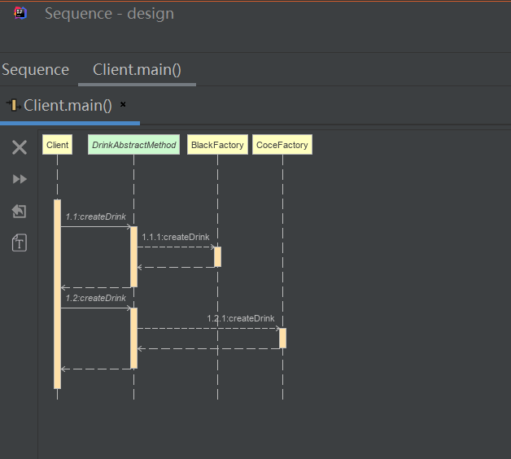
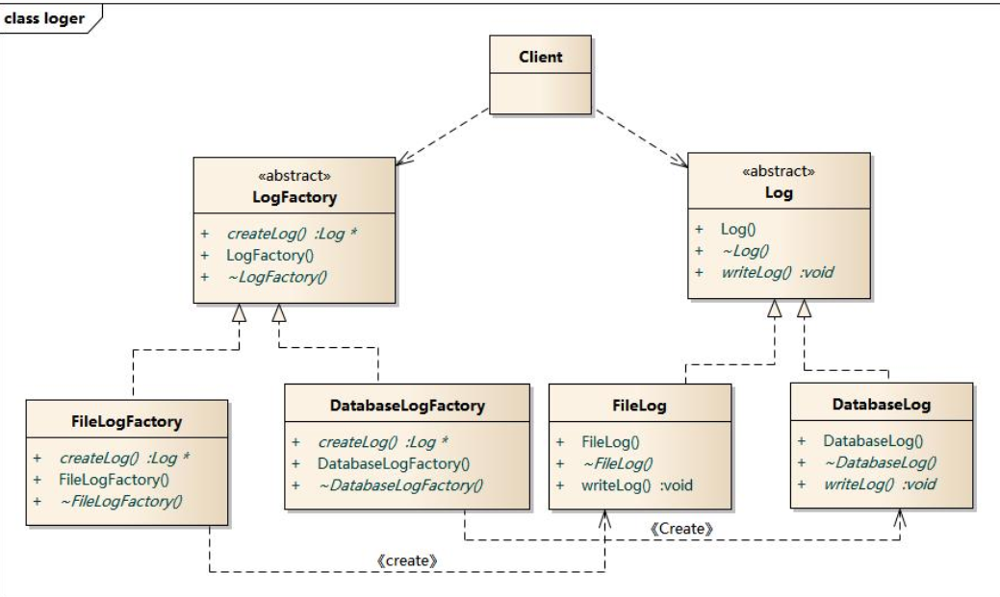
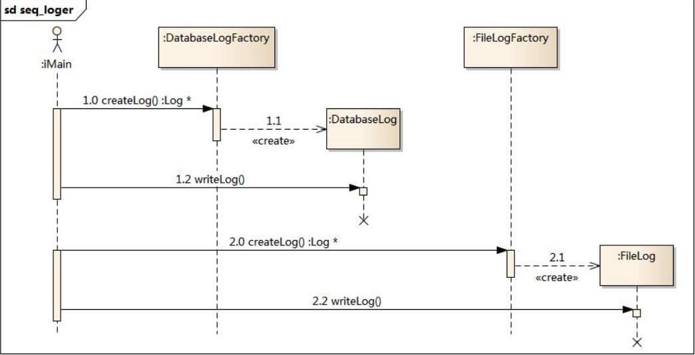
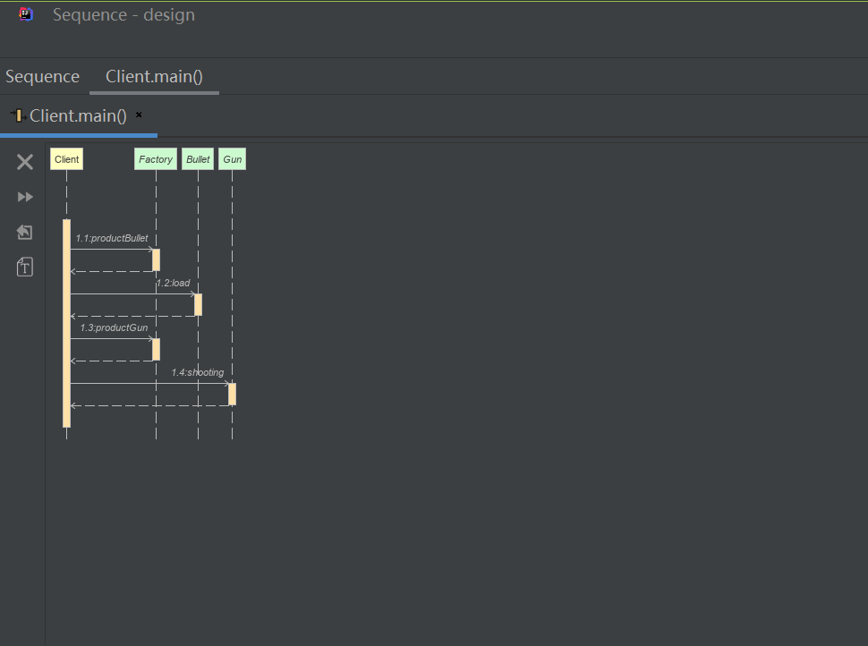

# 工厂模式
创建型模式(Creational Pattern)对类的**实例化过程**进行了**抽象**，能够将软件模块中对象的**创建和对象的使用**分离。为了使软件的结构更加清晰，外界对于这些对象只需要知道它们共同的接口，而不清楚其具体的实现细节，使整个系统的设计更加符合**单一职责原则**。

创建型模式在**创建什么**(What)，**由谁创建**(Who)，**何时创建**(When)等方面都为软件设计者提供了尽可能大的灵活性。创建型模式**隐藏**了类的实例的创建**细节**，通过隐藏对象如何被创建和组合在一起达到使整个系统独立的目的。

创建型包含的设计模式有：简单工厂（Simple  Factory）、工厂方法模式（Factory Method）、创建者模式（Builder）、原型模式(Prototype)、单例模式(Singleton)。
##  简单工厂

* **模式定义**

  简单工厂又称为静态工厂，它属于类创建型模式，可以根据不同的参数返回不同的实例

* **模式结构**

  * **Factor**y:工厂角色

    实现创建所有实例的内部逻辑

  * **Product**：抽象产品角色

    创建所有对象的父类

  * **ConcreateProduct**：具体产品角色

    创建的对象充当这个角色的某个具体类的实例

* **模式图**

  * 类图

    

  * 时序图

     

    

* **模式代码**

  [简单工厂github](https://github.com/fengchenzhihun1/design/tree/master/src/main/java/com/chenfeng/designtwo/creational_pattern/factory/simplefactory)

* **模式分析**

  * 对象的创建和对象的本身业务进行分离降低系统的耦合，使得两者修改起来比较容易
  * 工厂方法属于静态方法使用起来比较简单
  * 简单工厂的最大问题在于工厂类的职责过于重，增加新的产品需要修改共产类的业务逻辑
  * **简单共产类的要点在于**：当你需要什么时，只需传递一个正确的参数就可以创建所需要的对象而无需知道创建细节，

* **优点**

  * 共产类包含必要的判断逻辑，客户端免除创建对象的责任，只需要消费对象。实现了对职责的分割
  * 客户端无需知道所创建的具体类名，只需要知道具体的参数，对于一些复杂的类名，通过简单工厂可以减少记忆量
  * 可以通过引入配置文件，可以在不修改任何客户端代码的情况下更换和增加具体的产品类，在一定成都上增加了程序的灵活性

* **缺点**

  * 工厂类集中了所有产品的创建逻辑，一旦不能正常工作，整个系统都要受到影响
  * 会增加类的个数，在一定程度上增加了系统的复杂度和理解难度，不利于系统的扩展和维护
  * 由于使用了静态共产方法，造成工厂角色无法形成基于继承的等级结构

* **适用场景**

  *  工厂类创建对象较少
  * 客户端只知道传入工厂类的参数，对于如何创建对象并不关心

* **总结**

  - 创建型模式对类的实例化过程进行了抽象，能够将对象的创建与对象的使用过程分离。
  - 简单工厂模式又称为静态工厂方法模式，它属于类创建型模式。在简单工厂模式中，可以根据参数的不同返回不同类的实例。简单工厂模式专门定义一个类来负责创建其他类的实例，被创建的实例通常都具有共同的父类。
  - 简单工厂模式包含三个角色：工厂角色负责实现创建所有实例的内部逻辑；抽象产品角色是所创建的所有对象的父类，负责描述所有实例所共有的公共接口；具体产品角色是创建目标，所有创建的对象都充当这个角色的某个具体类的实例。
  - 简单工厂模式的要点在于：当你需要什么，只需要传入一个正确的参数，就可以获取你所需要的对象，而无须知道其创建细节。
  - 简单工厂模式最大的优点在于实现对象的创建和对象的使用分离，将对象的创建交给专门的工厂类负责，但是其最大的缺点在于工厂类不够灵活，增加新的具体产品需要修改工厂类的判断逻辑代码，而且产品较多时，工厂方法代码将会非常复杂。
  - 简单工厂模式适用情况包括：工厂类负责创建的对象比较少；客户端只知道传入工厂类的参数，对于如何创建对象不关心。

## 工厂方法模式（Factory Method Pattern）

* **模式定义**

  工厂方法模式又称为工厂模式，也叫虚拟构造器（Virtual Constructor）模式，或者多态工厂，它属于类创建型模式。该模式下，工厂父类负责定义创建产品对象的公共接口，而共产子类负责生成具体的产品对象，目的是将产品类的实例化操作延迟到工厂子类中完成，即通过子类来确定应该实例化哪一个具体产品类

* 模式结构

  * Product：抽象产品
  * ConcreteProduct：具体产品
  * Factory：抽象工厂
  * ConcreteFactory：具体工厂

* **模式图**

  **类图**

  

  **时序图**

  

  

* **模式代码**

  [模式代码github]( https://github.com/fengchenzhihun1/design/tree/master/src/main/java/com/chenfeng/designtwo/creational_pattern/factory/factorymethod )
  
* **模式分析**

   工厂方法模式是简单工厂模式的进一步抽象和推广。由于使用了面向对象的多态性，工厂方法模式保持了简单工厂模式的优点，而且克服了它的缺点。在工厂方法模式中，核心的工厂类不再负责所有产品的创建，而是将具体创建工作交给子类去做。这个核心类仅仅负责给出具体工厂必须实现的接口，而不负责哪一个产品类被实例化这种细节，这使得工厂方法模式可以允许系统在不修改工厂角色的情况下引进新产品。 

* **实例**

   某系统日志记录器要求支持多种日志记录方式，如文件记录、数据库记录等，且用户可以根据要求动态选择日志记录方式， 现使用工厂方法模式设计该系统。 

  **类图**

  

  **时序图**

  

* **优点**

  * 向客户隐藏了细节，用户只需关心对应的工厂而无需知道具体类名
  * 多态是工厂方法的关键
  * 加入新产品时无需修改抽象工厂和抽象产品，只需提供接口而无需修改客户端。系统的可扩展和维护性好

* 缺点

  * 在添加新产品时，需要编写新的具体产品类，还要提供与之对应的具体工厂类。系统中的类的个数会成对增加，增加了系统的复杂性。

  * 考虑到可扩展性，需要引入抽象层，在客户端代码中使用抽象定义，增加了系统的抽象性和理解难度，且在实现时节能需要用到DOM、反射等技术增加了系统的设计难度

* **使用环境**

  - 一个类不知道它所需要的对象的类：在工厂方法模式中，客户端不需要知道具体产品类的类名，只需要知道所对应的工厂即可，具体的产品对象由具体工厂类创建；客户端需要知道创建具体产品的工厂类。
  - 一个类通过其子类来指定创建哪个对象：在工厂方法模式中，对于抽象工厂类只需要提供一个创建产品的接口，而由其子类来确定具体要创建的对象，利用面向对象的多态性和里氏代换原则，在程序运行时，子类对象将覆盖父类对象，从而使得系统更容易扩展。
  - 将创建对象的任务委托给多个工厂子类中的某一个，客户端在使用时可以无须关心是哪一个工厂子类创建产品子类，需要时再动态指定，可将具体工厂类的类名存储在配置文件或数据库中。

* **模式应用**

  ```java
  Connection conn=DriverManager.getConnection("jdbc:microsoft:sqlserver://loc
  alhost:1433; DatabaseName=DB;user=sa;password=");
  Statement statement=conn.createStatement();
  ResultSet rs=statement.executeQuery("select * from UserInfo");
  ```

* **模式扩展**

  - 使用多个工厂方法：在抽象工厂角色中可以定义多个工厂方法，从而使具体工厂角色实现这些不同的工厂方法，这些方法可以包含不同的业务逻辑，以满足对不同的产品对象的需求。
  - 产品对象的重复使用：工厂对象将已经创建过的产品保存到一个集合（如数组、List等）中，然后根据客户对产品的请求，对集合进行查询。如果有满足要求的产品对象，就直接将该产品返回客户端；如果集合中没有这样的产品对象，那么就创建一个新的满足要求的产品对象，然后将这个对象在增加到集合中，再返回给客户端。
  - 多态性的丧失和模式的退化：如果工厂仅仅返回一个具体产品对象，便违背了工厂方法的用意，发生退化，此时就不再是工厂方法模式了。一般来说，工厂对象应当有一个抽象的父类型，如果工厂等级结构中只有一个具体工厂类的话，抽象工厂就可以省略，也将发生了退化。当只有一个具体工厂，在具体工厂中可以创建所有的产品对象，并且工厂方法设计为静态方法时，工厂方法模式就退化成简单工厂模式。

* **总结**

  - 工厂方法模式又称为工厂模式，它属于类创建型模式。在工厂方法模式中，工厂父类负责定义创建产品对象的公共接口，而工厂子类则负责生成具体的产品对象，这样做的目的是将产品类的实例化操作延迟到工厂子类中完成，即通过工厂子类来确定究竟应该实例化哪一个具体产品类。
  - 工厂方法模式包含四个角色：抽象产品是定义产品的接口，是工厂方法模式所创建对象的超类型，即产品对象的共同父类或接口；具体产品实现了抽象产品接口，某种类型的具体产品由专门的具体工厂创建，它们之间往往一一对应；抽象工厂中声明了工厂方法，用于返回一个产品，它是工厂方法模式的核心，任何在模式中创建对象的工厂类都必须实现该接口；具体工厂是抽象工厂类的子类，实现了抽象工厂中定义的工厂方法，并可由客户调用，返回一个具体产品类的实例。
  - 工厂方法模式是简单工厂模式的进一步抽象和推广。由于使用了面向对象的多态性，工厂方法模式保持了简单工厂模式的优点，而且克服了它的缺点。在工厂方法模式中，核心的工厂类不再负责所有产品的创建，而是将具体创建工作交给子类去做。这个核心类仅仅负责给出具体工厂必须实现的接口，而不负责产品类被实例化这种细节，这使得工厂方法模式可以允许系统在不修改工厂角色的情况下引进新产品。
  - 工厂方法模式的主要优点是增加新的产品类时无须修改现有系统，并封装了产品对象的创建细节，系统具有良好的灵活性和可扩展性；其缺点在于增加新产品的同时需要增加新的工厂，导致系统类的个数成对增加，在一定程度上增加了系统的复杂性。
  - 工厂方法模式适用情况包括：一个类不知道它所需要的对象的类；一个类通过其子类来指定创建哪个对象；将创建对象的任务委托给多个工厂子类中的某一个，客户端在使用时可以无须关心是哪一个工厂子类创建产品子类，需要时再动态指定。

## 抽象工厂（ Abstract Factory Pattern ）

* **模式动机**

  - 在工厂方法模式中具体工厂负责生产具体的产品，每一个具体工厂对应一种具体产品，工厂方法也具有唯一性，一般情况下，一个具体工厂中只有一个工厂方法或者一组重载的工厂方法。但是有时候我们需要一个工厂可以提供多个产品对象，而不是单一的产品对象。

    > 为了更清晰地理解工厂方法模式，需要先引入两个概念：
    >
    > - **产品等级结构** ：产品等级结构即产品的继承结构，如一个抽象类是电视机，其子类有海尔电视机、海信电视机、TCL电视机，则抽象电视机与具体品牌的电视机之间构成了一个产品等级结构，抽象电视机是父类，而具体品牌的电视机是其子类。
    > - **产品族** ：在抽象工厂模式中，产品族是指由同一个工厂生产的，位于不同产品等级结构中的一组产品，如海尔电器工厂生产的海尔电视机、海尔电冰箱，海尔电视机位于电视机产品等级结构中，海尔电冰箱位于电冰箱产品等级结构中。

  - 当系统所提供的工厂所需生产的具体产品并不是一个简单的对象，而是多个位于不同产品等级结构中属于不同类型的具体产品时需要使用抽象工厂模式。

  - 抽象工厂模式是所有形式的工厂模式中最为抽象和最具一般性的一种形态。

  - 抽象工厂模式与工厂方法模式最大的区别在于，工厂方法模式针对的是一个产品等级结构，而抽象工厂模式则需要面对多个产品等级结构，一个工厂等级结构可以负责多个不同产品等级结构中的产品对象的创建 。当一个工厂等级结构可以创建出分属于不同产品等级结构的一个产品族中的所有对象时，抽象工厂模式比工厂方法模式更为简单、有效率。

* **模式定义**

   抽象工厂模式(Abstract Factory Pattern)：提供一个创建一系列相关或相互依赖对象的接口，而无须指定它们具体的类。抽象工厂模式又称为Kit模式，属于对象创建型模式。 

* **模式结构**

  * AbstractFactory：抽象工厂
  * ConcreteFactory：具体工厂
  * AbstractProcuct：抽象产品
  * Product：具体产品 

* 模式图

  **类图**

  

  **时序图**

  

* **模式代码**

  [模式代码github]( https://github.com/fengchenzhihun1/design/tree/master/src/main/java/com/chenfeng/designtwo/creational_pattern/factory/abstractfactory )

* **优点**

  - 抽象工厂模式隔离了具体类的生成，使得客户并不需要知道什么被创建。由于这种隔离，更换一个具体工厂就变得相对容易。所有的具体工厂都实现了抽象工厂中定义的那些公共接口，因此只需改变具体工厂的实例，就可以在某种程度上改变整个软件系统的行为。另外，应用抽象工厂模式可以实现高内聚低耦合的设计目的，因此抽象工厂模式得到了广泛的应用。
  - 当一个产品族中的多个对象被设计成一起工作时，它能够保证客户端始终只使用同一个产品族中的对象。这对一些需要根据当前环境来决定其行为的软件系统来说，是一种非常实用的设计模式。
  - 增加新的具体工厂和产品族很方便，无须修改已有系统，符合“开闭原则”。

* **缺点**

  - 在添加新的产品对象时，难以扩展抽象工厂来生产新种类的产品，这是因为在抽象工厂角色中规定了所有可能被创建的产品集合，要支持新种类的产品就意味着要对该接口进行扩展，而这将涉及到对抽象工厂角色及其所有子类的修改，显然会带来较大的不便。
  - 开闭原则的倾斜性（增加新的工厂和产品族容易，增加新的产品等级结构麻烦）。

* **使用环境**

  在以下情况下可以使用抽象工厂模式：

  - 一个系统不应当依赖于产品类实例如何被创建、组合和表达的细节，这对于所有类型的工厂模式都是重要的。
  - 系统中有多于一个的产品族，而每次只使用其中某一产品族。
  - 属于同一个产品族的产品将在一起使用，这一约束必须在系统的设计中体现出来。
  - 系统提供一个产品类的库，所有的产品以同样的接口出现，从而使客户端不依赖于具体实现。

* **模式扩展**

  - - “开闭原则”要求系统对扩展开放，对修改封闭，通过扩展达到增强其功能的目的。对于涉及到多个产品族与多个产品等级结构的系统，其功能增强包括两方面：

      增加产品族：对于增加新的产品族，工厂方法模式很好的支持了“开闭原则”，对于新增加的产品族，只需要对应增加一个新的具体工厂即可，对已有代码无须做任何修改。增加新的产品等级结构：对于增加新的产品等级结构，需要修改所有的工厂角色，包括抽象工厂类，在所有的工厂类中都需要增加生产新产品的方法，不能很好地支持“开闭原则”。

  - 抽象工厂模式的这种性质称为“开闭原则”的倾斜性，抽象工厂模式以一种倾斜的方式支持增加新的产品，它为新产品族的增加提供方便，但不能为新的产品等级结构的增加提供这样的方便。

  - 

* 工厂模式的退化

   当抽象工厂模式中每一个具体工厂类只创建一个产品对象，也就是只存在一个产品等级结构时，抽象工厂模式退化成工厂方法模式；当工厂方法模式中抽象工厂与具体工厂合并，提供一个统一的工厂来创建产品对象，并将创建对象的工厂方法设计为静态方法时，工厂方法模式退化成简单工厂模式。 

* 总结

  - 抽象工厂模式提供一个创建一系列相关或相互依赖对象的接口，而无须指定它们具体的类。抽象工厂模式又称为Kit模式，属于对象创建型模式。
  - 抽象工厂模式包含四个角色：抽象工厂用于声明生成抽象产品的方法；具体工厂实现了抽象工厂声明的生成抽象产品的方法，生成一组具体产品，这些产品构成了一个产品族，每一个产品都位于某个产品等级结构中；抽象产品为每种产品声明接口，在抽象产品中定义了产品的抽象业务方法；具体产品定义具体工厂生产的具体产品对象，实现抽象产品接口中定义的业务方法。
  - 抽象工厂模式是所有形式的工厂模式中最为抽象和最具一般性的一种形态。抽象工厂模式与工厂方法模式最大的区别在于，工厂方法模式针对的是一个产品等级结构，而抽象工厂模式则需要面对多个产品等级结构。
  - 抽象工厂模式的主要优点是隔离了具体类的生成，使得客户并不需要知道什么被创建，而且每次可以通过具体工厂类创建一个产品族中的多个对象，增加或者替换产品族比较方便，增加新的具体工厂和产品族很方便；主要缺点在于增加新的产品等级结构很复杂，需要修改抽象工厂和所有的具体工厂类，对“开闭原则”的支持呈现倾斜性。
  - 抽象工厂模式适用情况包括：一个系统不应当依赖于产品类实例如何被创建、组合和表达的细节；系统中有多于一个的产品族，而每次只使用其中某一产品族；属于同一个产品族的产品将在一起使用；系统提供一个产品类的库，所有的产品以同样的接口出现，从而使客户端不依赖于具体实现。


