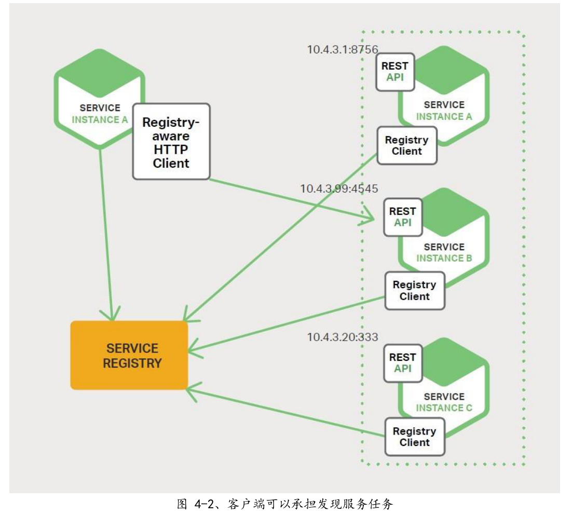
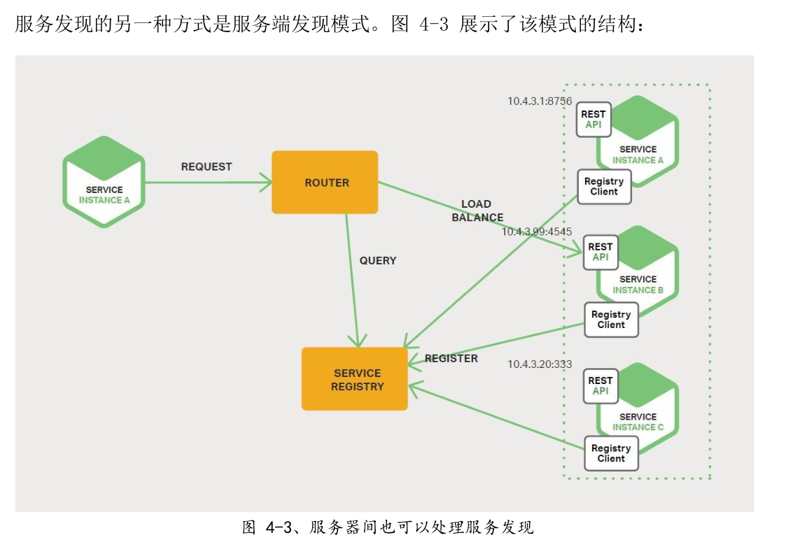
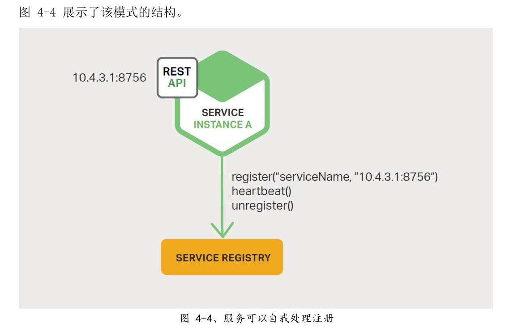
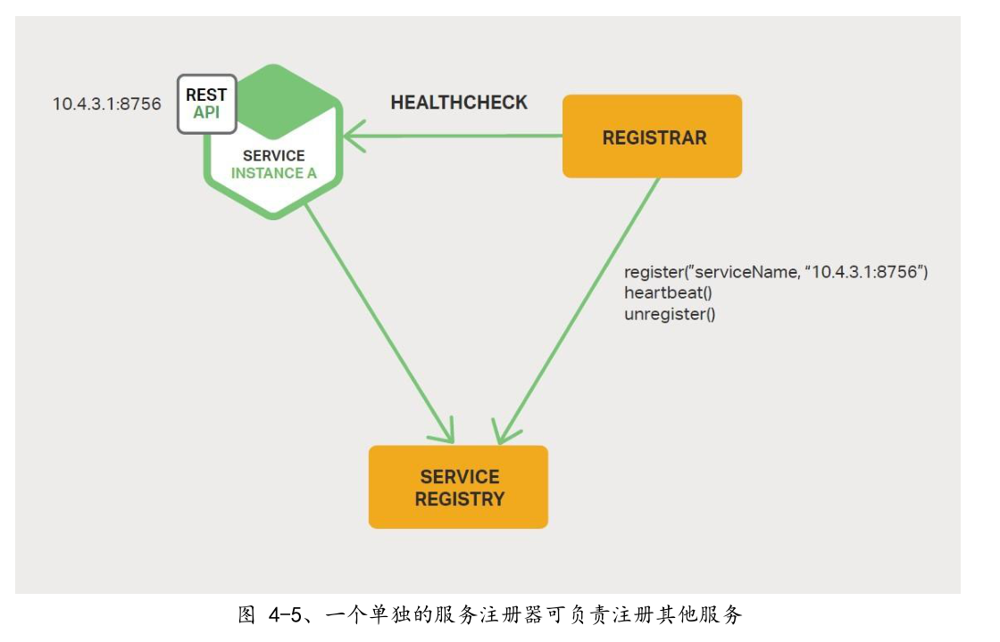

---
  
---

# 神书：微服务从设计到部署学习笔记

**持续更新中.....**

**不管是springCloudNetflix组件还是SpringClude阿里巴巴还是其他微服务组件无法是为了解决如下四个问题**

1. ***客户端如何访问微服务***
2. ***服务与服务之间如何通信，怎么发现***
3. ***那么多服务如何管理***
4. ***服务挂了怎么办***

**可以Netflix系组件与阿里系组件都是为了解决上述问题、**

**[神书中文版Git地址](https://docshome.gitbooks.io/microservices/content/)**

## 1. 微服务简介

### 1.1 构建单体应用

​	所谓单体应用就是说所有外部暴露的接口或者对外服务的组件都是由核心应用进行提供的。在项目早期的优点是：易于开发、易于测试、易于部署、易于维护

### 1.2走向单体地狱

​	随着时间的推移单体应用的弊端就暴露出来了.

 	1. 比如说系统变得越来越大。代码变得越来越臃肿，对于修改bug和实现新功能带来了极大的挑战
 	2. 应用的启动时间也将变得越来越长
 	3. 可靠性问题，一个功能点的异常可能会导致整个系统崩溃
 	4. 持续部署也将变得不可能
 	5. 资源发生冲突时，单体应用难以扩展（比如一个模块执行cpu密集型，另外一个模块是内存数据库适合部署到其他实例上）
 	6. 采用新的矿建非常困难

### 1.3微服务 - 解决复杂问题

 	1. 將应用程序分解为一套较小的互联服务，一个服务实现一个功能
 	2. 提供对外服务的接口
 	3. 每个实例运行在一个云虚拟主机或者一个Docke容器上

### 1.4微服务的优点

 	1. 解决了复杂问题。（应用拆分，个体开发，易维护理解）
 	2. 每个服务可以由专门的团队进行开发。
 	3. 实现微服务的福利部署

### 1.5微服务的缺点

 	1. 名称本身，偏重于微服务的规模
 	2. 是一个分布式系统，使整体变得复杂
 	3. 分区数据架构苦难
 	4. 测试复杂
 	5. 跨越多服务变更
 	6. 部署复杂

### 1.6总结

​	构建复杂的微服务本质上是复杂的、单体应用只适用于简单、轻量的程序，复杂的话微服务是一个很好的选择。尽管他有缺点和实现挑战

### 微服务实战：NGINX Plus作为反向代理服务器

​	nginx反向代理	

## 2. 使用API网关

### 2.1 简介

​	关于API网关，要先举个栗子更容易理解。例如购物网站中的商品，它不仅包含商品的详细信息，海报库库存、型号、商品评价等一系列的信息。

​	在单体应用中，上述信息一般是通过一个接口向一个应用上发送请求。大寝室在微服务架构中就稍有不同了，那些信息会来自多个微服务。我们需要决定客户端应该如何访问这些服务。

### 2.2客户端与微服务直接通信

​	直接通信就以为直连，既上述的每个信息都将由各自的微服务提供接口，但是这种方式存在着很大的限制。主要如下

 	1. 客户端的需求与每个微服务暴露的细粒度API不匹配、需要多次请求
 	2. 使用非web友好协议

### 2.3使用API网关

​	API网关是有个服务器，是系统的单入口、它类似与，门面设计模式。网关丰庄路内部细节可以针对每个客户提供定制API，而且还具有认证、监控、负责均衡、缓存、静态相应处理、

​	API网关负责请求路由、组合和协议转换。

### 2.4API网关的优点与缺点

​	**优点**

  * 封装程序的内部结构客户端只需要与API通信

  * 减少了客户端与应用程序之间的往返测试，简化了客户端的代码

    **缺点**

* 是一个高度可用的组件需要开发部署和管理

* APi网关可能会成为开发瓶颈

### 2.5实施API网关

#### 2.5.1 性能与可扩展性

 * 处理数据规模
 * 使用NIO框架

#### 2.5.2使用响应式编程模型

​	对于请求彼此独立的服务，为了缩短时间，API网关应该执行并发操作，有时候请求是相互依赖的，使用传统的异步调用来编写API会使我们陷入回调地狱，好的方法是使用响应式方法以声明式编写API网关代码

#### 2.5.3服务调用

​	微服务应用是一个分布式系统，必须使用一个进程间通信机制。

  * 基于消息的异步机制（消息代理）JMS、AMQP。（无代理直接与服务通信）Zeromq

  * 进程间同步如HTTP和Thrift

    因此APi网关需要支持各种通信机制	

#### 2.5.4服务发现

​	使用系统发现机制：服务端发现或客户端发现

#### 2.5.5处理局部故障

​	局部故障问题，当一个服务调用另外一个服务缓慢或者不可用的服务时，API网关不应该无期限的等待下游服务。

### 2.6总结

​	处理网关请求，还可以在出现问题时还可以返回默认数据，掩盖后端服务故障

### 微服务实战：NGINX Plus作为API网关

 * 访问管理
 * 客观理性与弹性
 * 与第三方工具集成

## 3进程间通信

### 3.1简介

	* 单体应用通过语言级别的方法或者函数进行调用
	* 微服务是运行在多台机器上的分布式系统，通常每个实例都是一个进程 	

### 3.2交互方式

**两大类**

1. 一对一一对多

   * **一对一** 每个客户端请求由一个服务实例处理
   * **一对多** 每个请求由对个服务实例处理

2. 同步异步

   **同步** 客户端要求服务及时响应，在等待过程中可能会发生阻塞

   **异步** 客户端在等待中不会产生阻塞，但响应不一定立即返回

3. 各种交互方式

   | **-** | 一对一    | 一对多        |
   | :---: | --------- | ------------- |
   | 同步  | 请求/响应 | -             |
   | 异步  | 通知      | 发布/订阅     |
   | 异步  | 请求/响应 | 发布/异步响应 |

   * **请求/响应 **

     客户端向服务发出请求并等待响应。客户端要求响应及时到达。在基于线程的应用程序中，发出请求的线程可能在等待时发生阻塞。 

   * **通知（又称为单向请求）**

     客户端向服务发送请求，但不要求响应。 

   * **请求/异步响应**

     客户端向服务发送请求，服务异步响应。客户端在等待时不发生阻止，适用于假设响应可能不会立即到达的场景。 

     一对多交互可分为以下列举的类型，它们都是异步的**：**

   * **发布 发布/订阅客户端**  

     发布通知消息，由零个或多个感兴趣的服务消费。

   * **发布 发布/异步响应** 

     客户端发布请求消息，之后等待一定时间来接收消费者的响应。 

### 3.3定义API

​	服务API是服务与客户端之间的契约。

### 3.4演化API

	* 服务APi总是随着时间而变化。
	* 无法强制所有客户端与服务器升级的节奏一直，因此需要逐步部署
	* 需要向后尖肉，应遵循鲁棒性原则
	* 版本号嵌入，每个服务同时处理多个版本

### 3.5处理局部故障

**nginx给出的方案**

* 网络超时
* 限制未完成的请求数量
* 断路器模式
* 提供回退  返回缓存数据或者默认值

### 3.6IPC技术

​	进程间通信技术

### 3.7异步、基于消息的通信

 	消息通过通道进行交换，用两种通信类型

1. 点对点通道

   一对一交互

2. 发布订阅通道

   一对多交互

   使用信息传递的优点

1. 将客户端与 服务进行分离

2. 消息缓冲

3. 灵活的客户端-服务交换

4. 毫无隐瞒的进程间通信

   缺点

1.  额外的复杂度
2. 实施基于请求/响应交互的复杂性

### 3.8同步的请求/响应 IPC

#### 3.9.1REST

 1. REST通常表示业务对象，如客户、产品这些业务对象的集合

 2. REST使用HTTP动词（谓词）来操作对象

    REST成熟度模型层次

    - **级别0**  客户端唯一端点调用服务 post
    - **级别1**  资源概念  post
    - **级别2** 使用API谓词 post get put delete
    - **级别3** 非常规命名，HATEOAS

    基于http的协议有很多好处

    * 简单易懂
    * 使用浏览器扩展（如postman），或者使用curl
    * 直接支持请求/响应式通信
    * 不需要中间代理

    缺点

    * 服务器需要始终发送http响应
    * 直通（没有中间这缓冲信息），必须一直都在运行、
    * 客户端必须知道每个服务的位置

#### 3.9.2Thrift

​	APatchThrift是一个rest的有趣替代方案

### 3.9消息格式

 1. xml

 2. json

    jsonSchedule

 3. Protocol Buffers

 4. ApacheAvro

#### 3.10总结

​	微服务必须使用进程间通信机制进行通信。在设计服务如何进行通信时，您需要考虑各种问题：服务如何交互、如何为每个服务指定 API、如何演变 API 以及如何处理局部故障。微服务可以使用两种 IPC 机制：异步消息传递和同步请求/响应。为了进行通信，一个服务必须能够找到另一个服务

### 微服务实战：NGINX与应用程序架构

## 4.服务发现

### 4.1为何使用服务发现

​	服务实例具有动态分配的网络位置。此外，由于自动扩缩、故障与升级，整组服务实例会动态变更。因此，您的客户端代码需要使用更精确的服务发现机制。 

​	主要有两种发现机制

* 客户端发现
* 服务端发现

### 4.2客户端发现模式

​	客户端发现负责确定可用服务的网络位置和请求负载均衡，客户端查询注册中心，利用balance算法选择一个可用实例并发送请求。

​	服务启动时被注册，服务终止时被移除、通常使用心跳机制周期性刷新服务实例的注册信息 

​	**优点**

1. 该模式相对简单
2. 使用特定于应用程序的复杂均衡

​	**缺点**

 	1. 客户端与服务注册中心耦合在一起，必须为每种编程语言和框架实现客户端发现逻辑

### 4.3服务端发现模式

​	服务端发现模式有几个优点与缺点。该模式的一大的优点是把发现的细节从客户端抽象出来。客户端只需向负载均衡器发出请求。这消除了为服务客户端使用的每种编程语言和框架都实现发现逻辑的必要性。另外，如上所述，一些部署环境免费提供此功能。然而，这种模式存在一些缺点。除非负载均衡器由部署环境提供，否则您需要引入这个高可用系统组件，并进行设置和管理。 

### 4.4服务注册中心

​	注册中心是服务发现的一个关键怒分，它是一个包含了服务实例网络位置的数据。同时使用复制协议来维护一致性。

### 4.5服务注册方式

​	服务实例必须在服务注册中心注册于销毁。

	1. 服务实例自我注册，即自注册模式。
 	2. 使用其他系统组件来管理服务实例的注册，即第三次注册，模式。

### 4.6自注册模式

​	

​	自注册模式有好有坏。一个好处是它相对简单，不需要任何其他系统组件。然而，主要缺点是它将服务实例与服务注册中心耦合。您必须为服务使用的每种编程语言和框架都实现注册代码。 将服务与服务注册中心分离的替代方法是第三方注册模式。 

#### 4.7第三方注册模式

​	当使用第三方注册模式时，服务实例不再负责向服务注册中心注册自己。相反，该工作将由被称为服务注册器（service registrar）的另一系统组件负责。服务注册器通过轮询部署环境或订阅事件来跟踪运行实例集的变更情况。当它检测到一个新的可用服务实例时，它会将该实例注册到服务注册中心。此外，服务注册器可以注销终止的服务实例。 

	第三方注册模式同样有好有坏。一个主要的好处是服务与服务注册中心之间解耦。您
不需要为开发人员使用的每种编程语言和框架都实现服务注册逻辑。相反，仅需要在
专用服务中以集中的方式处理服务实例注册。 
该模式的一个缺点是，除非部署环境内置，否则您同样需要引入这样一个高可用的系
统组件，并进行设置和管理。 

### 微服务实战：NGINX的灵活性

## 5.事件驱动数据管理

### 5.1微服务和分布式数据管理问题

​	单体应用通常有一个单一的关系型数据库，主要优点是可以使用ACID事物，提供以下保障

 1. **原子性** 原子操作不可分割

 2. **一致性** 状态保持一致

 3. **隔离性** 即使是并发执行，看起来更像是串行

 4. **永久性** 事物提交，不可撤销

    基于微服务的应用程序通常混合使用SQL和NoSQL，即所谓的混合持久化

    1. 如何维护多个服务之间的业务事物一致性
    2. 如何从多个服务中检索数据

### 5.2事件驱动架构

​	**事件驱动**：微服务在发生某些重要事件时发布一个事件、

### 5.3实现原子性

​	事件驱动架构中，同样存在着原子更新数据库和发布事件相关问题

### 5.4使用本地事物发布事件

​	应用程序使用仅涉及本地事物的多步骤过程来发布事物。

### 5.5挖掘数据库事务日志

​	不依靠 2PC 来实现原子性的另一种方式是使用线程或进程发布事件，该线程或进程对数据库的事务或者提交日志进行挖掘。当应用程序更新数据库时，更改信息被记录到数据库的事务日志中。Transaction Log Miner 线程或进程读取事务日志并向 Message Broker 发布事件

​	

### 5.6使用事件溯源

​	事件溯源通过使用完全不同的、不间断的方式来持久化业务实体，实现无 2PC 原应用程序不存储实体的当前状态，而是存储一系列状态改变事件。该应用程序通放事件来重建实体的当前状态。无论业务实体的状态何时发生变化，其都会将新追加到事件列表中。由于保存事件是一个单一操作，因此具有原子性。 

### 5.7总结

​	在微服务架构中，每个微服务都有自己私有的数据存储。不同的微服务可能会使用不同的 SQL 或者 NoSQL 数据库。虽然这种数据库架构具有明显的优势，但它创造了一些分布式数据管理挑战。第一个挑战是如何实现维护多个服务间的业务事务一致性。第二个挑战是如何实现从多个服务中检索数据。 大部分应用使用的解决方案是事件驱动架构。实现事件驱动架构的一个挑战是如何以原子的方式更新状态以及如何发布事件。有几种方法可以实现这点，包括了将数据库作为消息队列、事务日志挖掘和事件溯源。 

### 微服务实战：NGINX与存储优化

## 6选择部署策略

### 6.1动机

​	微服务应用程序由数十甚至上百个服务组成。服务以不同的语言和是一个迷你的应用程序，具有自己特定的部署、资源、扩展和监视要根据该服务的需求运行每个服务的一定数量的实例。此外，必须供相应的 CPU、内存和 I/O 资源。更具挑战性的是尽管如此复杂，速、可靠和具有成本效益。 

### 6.2单主机多服务实例模式

​	部署微服务的一种方式是使用单主机多服务实例（Multiple Service Instances perHost）模式。当使用此模式时，您可以提供一个或多个物理主机或虚拟主机，并在每个上运行多个服务实例。从多方面来讲，这是应用程序部署的传统方式。每个服务实例在一个或多个主机的标准端口上运行。主机通常被当作宠物对待。 

### 6.3每个主机一个服务实例模式

​	每个虚拟机一个服务实例模式和每个容器一个服务实例模式。 

#### 6.3.1每个虚拟机一个服务实例模式

​	

#### 6.3.2每个容器一个服务器实例模式

​	当您使用每个容器一个服务实例模式（Service Instance per Container）模式时，每个服务实例都在其自己的容器中运行。容器是一个操作系统级虚拟化机制。一个容器是由一个或多个运 行在沙箱中的你    进程组成。从进程的角度来看，它们有自己的端口命名空间和根文件系统。您可以限制容器的内存和 CPU 资源。一些容器实现也具有 I/O 速率限制。容器技术的相关例子有 Docker 和 Solaris Zones。 

### 6.4Serverless部署

### 6.5总结

### 微服务实战：使用NGINX在不同主机上部署微服务

## 7重构单体应用为微服务

### 7.1微服务重构概述

### 7.2策略一：停止挖掘

​	洞穴定律说到，每当您身处在一个洞穴中，您应该停止挖掘以管理时，这是一个很好的建议。换句话说，您应该停止扩这意味着当您要实现新功能时，您不应该向单体添加更多的主要思想是将新代码放在独立的微服务中。 

### 7.3策略二：前后端分离

​	**表现层（ 表现层（Presentation Layer Presentation Layer，PL PL）** 

​		处理 HTTP 请求并实现（REST）API 或基于 HTML 的 Web UI 组件。在具有复杂用户界面的应用中，表现层通常存在大量代码。 

​	**业务逻辑层（ 业务逻辑层（Business Logic Layer Business Logic Layer，BLL BLL） **

​		作为应用程序核心，实现业务规则的组件。 

​	**数据访问层（ 数据访问层（Data Access Layer Data Access Layer，DAL DAL）** 

​		访问基础架构组件的组件，如数据库和消息代理。

## 7.4策略三：提取服务 你

#### 7.4.1优先将那些模块转换为微服务

#### 7.4.2如何提取模块

### 7.5总结

### 微服务实战：用NGINX征服单体

