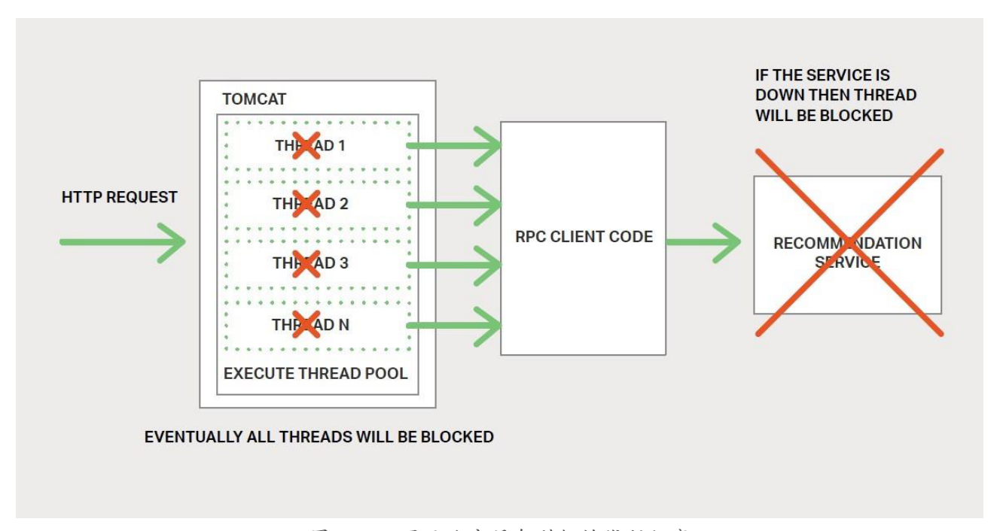

---
  
---

# 神书：微服务从设计到部署学习笔记

**持续更新中.....**

**不管是springCloudNetflix组件还是SpringClude阿里巴巴还是其他微服务组件无法是为了解决如下四个问题**

1. ***客户端如何访问微服务***
2. ***服务与服务之间如何通信，怎么发现***
3. ***那么多服务如何管理***
4. ***服务挂了怎么办***

**可以Netflix系组件与阿里系组件都是为了解决上述问题、**

**[神书中文版Git地址](https://docshome.gitbooks.io/microservices/content/)**

## 1. 微服务简介

### 1.1 构建单体应用

​	所谓单体应用就是说所有外部暴露的接口或者对外服务的组件都是由核心应用进行提供的。在项目早期的优点是：易于开发、易于测试、易于部署、易于维护

### 1.2走向单体地狱

​	随着时间的推移单体应用的弊端就暴露出来了.

 	1. 比如说系统变得越来越大。代码变得越来越臃肿，对于修改bug和实现新功能带来了极大的挑战
 	2. 应用的启动时间也将变得越来越长
 	3. 可靠性问题，一个功能点的异常可能会导致整个系统崩溃
 	4. 持续部署也将变得不可能
 	5. 资源发生冲突时，单体应用难以扩展（比如一个模块执行cpu密集型，另外一个模块是内存数据库适合部署到其他实例上）
 	6. 采用新的矿建非常困难

### 1.3微服务 - 解决复杂问题

 	1. 將应用程序分解为一套较小的互联服务，一个服务实现一个功能
 	2. 提供对外服务的接口
 	3. 每个实例运行在一个云虚拟主机或者一个Docke容器上

### 1.4微服务的优点

 	1. 解决了复杂问题。（应用拆分，个体开发，易维护理解）
 	2. 每个服务可以由专门的团队进行开发。
 	3. 实现微服务的福利部署

### 1.5微服务的缺点

 	1. 名称本身，偏重于微服务的规模
 	2. 是一个分布式系统，使整体变得复杂
 	3. 分区数据架构苦难
 	4. 测试复杂
 	5. 跨越多服务变更
 	6. 部署复杂

### 1.6总结

​	构建复杂的微服务本质上是复杂的、单体应用只适用于简单、轻量的程序，复杂的话微服务是一个很好的选择。尽管他有缺点和实现挑战

### 微服务实战：NGINX Plus作为反向代理服务器

​	nginx反向代理	

## 2. 使用API网关

### 2.1 简介

​	关于API网关，要先举个栗子更容易理解。例如购物网站中的商品，它不仅包含商品的详细信息，海报库库存、型号、商品评价等一系列的信息。

​	在单体应用中，上述信息一般是通过一个接口向一个应用上发送请求。大寝室在微服务架构中就稍有不同了，那些信息会来自多个微服务。我们需要决定客户端应该如何访问这些服务。

### 2.2客户端与微服务直接通信

​	直接通信就以为直连，既上述的每个信息都将由各自的微服务提供接口，但是这种方式存在着很大的限制。主要如下

 	1. 客户端的需求与每个微服务暴露的细粒度API不匹配、需要多次请求
 	2. 使用非web友好协议

### 2.3使用API网关

​	API网关是有个服务器，是系统的单入口、它类似与，门面设计模式。网关丰庄路内部细节可以针对每个客户提供定制API，而且还具有认证、监控、负责均衡、缓存、静态相应处理、

​	API网关负责请求路由、组合和协议转换。

### 2.4API网关的优点与缺点

​	**优点**

  * 封装程序的内部结构客户端只需要与API通信

  * 减少了客户端与应用程序之间的往返测试，简化了客户端的代码

    **缺点**

* 是一个高度可用的组件需要开发部署和管理

* APi网关可能会成为开发瓶颈

### 2.5实施API网关

#### 2.5.1 性能与可扩展性

 * 处理数据规模
 * 使用NIO框架

#### 2.5.2使用响应式编程模型

​	对于请求彼此独立的服务，为了缩短时间，API网关应该执行并发操作，有时候请求是相互依赖的，使用传统的异步调用来编写API会使我们陷入回调地狱，好的方法是使用响应式方法以声明式编写API网关代码

#### 2.5.3服务调用

​	微服务应用是一个分布式系统，必须使用一个进程间通信机制。

  * 基于消息的异步机制（消息代理）JMS、AMQP。（无代理直接与服务通信）Zeromq

  * 进程间同步如HTTP和Thrift

    因此APi网关需要支持各种通信机制	

#### 2.5.4服务发现

​	使用系统发现机制：服务端发现或客户端发现

#### 2.5.5处理局部故障

​	局部故障问题，当一个服务调用另外一个服务缓慢或者不可用的服务时，API网关不应该无期限的等待下游服务。

### 2.6总结

​	处理网关请求，还可以在出现问题时还可以返回默认数据，掩盖后端服务故障

### 微服务实战：NGINX Plus作为API网关

 * 访问管理
 * 客观理性与弹性
 * 与第三方工具集成

## 3进程间通信

### 3.1简介

	* 单体应用通过语言级别的方法或者函数进行调用
	* 微服务是运行在多台机器上的分布式系统，通常每个实例都是一个进程 	

### 3.2交互方式

**两大类**

1. 一对一一对多

   * **一对一** 每个客户端请求由一个服务实例处理
   * **一对多** 每个请求由对个服务实例处理

2. 同步异步

   **同步** 客户端要求服务及时响应，在等待过程中可能会发生阻塞

   **异步** 客户端在等待中不会产生阻塞，但响应不一定立即返回

3. 各种交互方式

   | **-** | 一对一    | 一对多        |
   | :---: | --------- | ------------- |
   | 同步  | 请求/响应 | -             |
   | 异步  | 通知      | 发布/订阅     |
   | 异步  | 请求/响应 | 发布/异步响应 |

   * **请求/响应 **

     客户端向服务发出请求并等待响应。客户端要求响应及时到达。在基于线程的应用程序中，发出请求的线程可能在等待时发生阻塞。 

   * **通知（又称为单向请求）**

     客户端向服务发送请求，但不要求响应。 

   * **请求/异步响应**

     客户端向服务发送请求，服务异步响应。客户端在等待时不发生阻止，适用于假设响应可能不会立即到达的场景。 

     一对多交互可分为以下列举的类型，它们都是异步的**：**

   * **发布 发布/订阅客户端**  

     发布通知消息，由零个或多个感兴趣的服务消费。

   * **发布 发布/异步响应** 

     客户端发布请求消息，之后等待一定时间来接收消费者的响应。 

### 3.3定义API

​	服务API是服务与客户端之间的契约。

### 3.4演化API

	* 服务APi总是随着时间而变化。
	* 无法强制所有客户端与服务器升级的节奏一直，因此需要逐步部署
	* 需要向后尖肉，应遵循鲁棒性原则
	* 版本号嵌入，每个服务同时处理多个版本

### 3.5处理局部故障

**nginx给出的方案**

* 网络超时
* 限制未完成的请求数量
* 断路器模式
* 提供回退  返回缓存数据或者默认值

### 3.6IPC技术

​	进程间通信技术

### 3.7异步、基于消息的通信

 	消息通过通道进行交换，用两种通信类型

1. 点对点通道

   一对一交互

2. 发布订阅通道

   一对多交互

3. 

### 3.8同步的请求/响应IPC

#### 3.9.1REST

#### 3.9.2Thrift

### 3.9消息格式

#### 3.10总结

### 微服务实战：NGINX与应用程序架构

## 4.服务发现

### 4.1为何使用服务发现

### 4.2客户端发现模式

### 4.3服务端发现模式

### 4.4服务注册中心

### 4.5服务注册方式

### 4.6自注册模式

#### 4.7第三方注册模式

### 微服务实战：NGINX的灵活性

### 微服务实战：NGINX的灵活性

## 5.事件驱动数据管理

### 5.1微服务和分布式数据管理问题

### 5.2事件驱动架构

### 5.3实现原子性

### 5.4使用本地事物发布事件

### 5.5挖掘数据库事务日志

### 5.6使用事件溯源

### 5.7总结

### 微服务实战：NGINX与存储优化

## 6选择部署策略

### 6.1动机

### 6.2单主机多服务实例模式

### 6.3每个主机一个服务实例模式

#### 6.3.1每个虚拟机一个服务实例模式

#### 6.3.2每个容器一个服务器实例模式

### 6.4Serverless部署

### 6.5总结

### 微服务实战：使用NGINX在不同主机上部署微服务

## 7重构单体应用为微服务

### 7.1微服务重构概述

### 7.2策略一：停止挖掘

### 7.3策略二：前后端分离

### 7.4策略三：提取服务

#### 7.4.1优先将那些模块转换为微服务

#### 7.4.2如何提取模块

### 7.5总结

### 微服务实战：用NGINX征服单体

