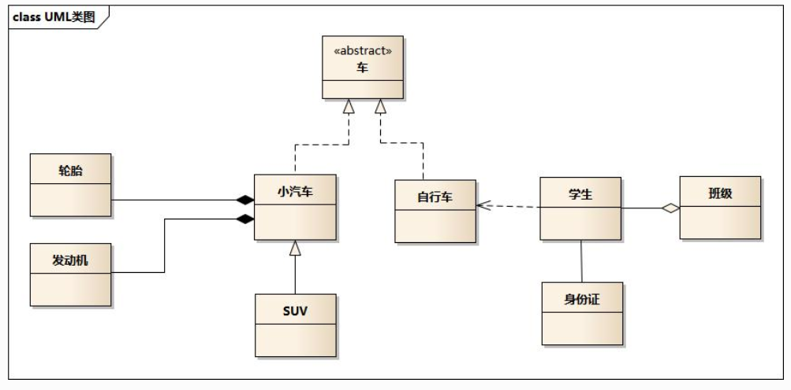

# UML

## 类图整体图

### 整体结构图概要

* 实现

  小汽车是车的实现类，用的是空心的类型加虚线，因为很虚所以用的虚线

* 泛化

  泛化就是实现的意思

  suv是小汽车的子类，suv继承了小汽车

* 依赖

  自行车依赖学生（一般是用作参数）多用于运行时，可以动态进行变化，用的是带箭头的虚线

  双向依赖是一种非常糟糕的结构，我们应该保持单向依赖杜绝双向依赖的产生

* 聚合

  学生与班级的关系就是聚合

  聚合是一种带空心菱形箭头的直线表示，表达的是A聚合到B上，或者说B由A组成

  表示的是整体由部门构成，例如一个部门由多个员工组成

  与组合关系不同的是，整体和部分不是强依赖的，即整体不存在了，部分依然存在；

* 组合关系

  轮胎与小汽车的关系就是组合关系。是一个整体，不可分割

* 关联

  直线，表示的是一种静态关系，是一种强关联。不强调方向，如果强调方向就是A知道B，B不知道A、通常对象通常是以成员变量的形式实现的。

## 时序图

### 概念

显示对象之间的交互细节，是显示对象之间交互的图。时序图中显示的是参与交互的对象及其对象之间消息交换的顺序。

### 建模元素

对象（Actor）、生命线（Lifeline）、控制焦点（Focus of control）、消息（Message）

​	

